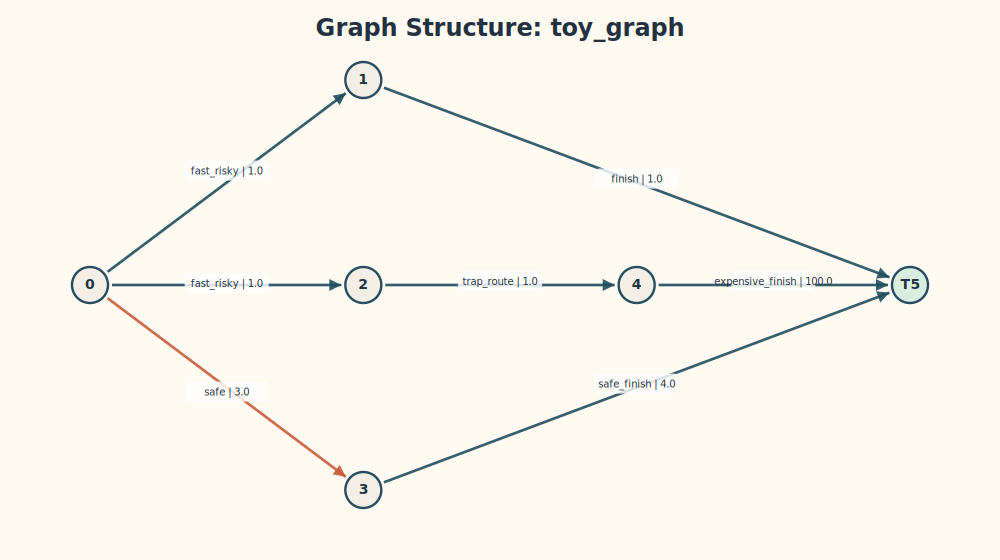

# 实验结果

本节汇总 Robust Shortest Path, RSP, 复现实验中的主要图表与结论，覆盖 toy example、实验 3 的中规模效率比较，以及实验 4 的鲁棒性对比。实验所用图像位于 [figures](figures)。如果按本文命令重跑，CSV 会写到项目根目录下的 [results](../results)；仓库中随附的正式实验数据保存在 [experiment_data/official_20260521_210335](../experiment_data/official_20260521_210335)。

## 1. 实验总览

本次复现实验围绕 Bertsekas 的 Robust Shortest Path, RSP, 问题展开。项目中实现并对比了以下几类算法：

- `vi`：Value Iteration
- `pi`：Policy Iteration
- `dijkstra`：Dijkstra-like label-setting
- `exhaustive`：小规模 proper policies 枚举
- `baseline_nominal`、`baseline_bestcase`、`baseline_worst_immediate`：deterministic baselines

整体实验目标分为三部分：

1. 在 toy graph 上验证各核心算法得到一致的 robust optimal value，并展示鲁棒策略相对普通 deterministic planning 的优势。
2. 在中规模 layered DAG 随机图上比较 `vi`、`pi`、`dijkstra` 的运行效率。
3. 在存在 successor uncertainty 的图上比较 deterministic baselines 与 robust policy 的 adversarial worst-case cost。

## 2. 实验 1：Toy Example

toy graph 用于展示 RSP 与普通最短路在优化目标上的本质差异。节点 0 有两个动作：

- `fast_risky`：当前代价小，但 successor 集合为 `{1, 2}`，对抗者可选择更差后继。
- `safe`：当前代价更高，但 successor 唯一，最坏代价稳定。

图结构如下：



根据 Bellman 方程，可手算得到 toy graph 的 robust optimal values：

| node | value |
| --- | ---: |
| 0 | 7 |
| 1 | 1 |
| 2 | 101 |
| 3 | 4 |
| 4 | 100 |
| 5 | 0 |

仓库中 `vi`、`pi`、`dijkstra`、`exhaustive` 的输出完全一致，说明核心算法在 toy graph 上求得了同一组最优值：


其中，robust policy 在节点 0 选择 `safe`，图中高亮显示如下：


若将 nominal baseline 放到 adversarial environment 中执行，对抗者会把路径导向更差的 successor；而 robust policy 会直接规避该风险：


toy graph 的核心结论如下：

- nominal baseline 的 worst-case cost 为 `102`。
- robust policy 的 worst-case cost 为 `7`。
- 因此，RSP 求解的是“对抗最坏后继下的最优 policy”，而不是名义意义下最短的一条 path。

这一结果说明，鲁棒最短路问题的重点不在于寻找单条最短路径，而在于选择一条在所有允许转移中都能控制最坏代价的策略。

## 3. 实验 3：中规模效率比较

实验 3 使用 layered DAG 随机图，规模为 `n = 20, 50, 100, 200`，每个规模包含 20 张图。比较对象为 `vi`、`pi`、`dijkstra` 三个核心算法。

综合图如下：


根据 [experiment_data/official_20260521_210335/exp3_runtime/results/runtime_summary.csv](../experiment_data/official_20260521_210335/exp3_runtime/results/runtime_summary.csv) 中的正式数据，可以整理出如下结果：

| n | algorithm | success_rate | avg_runtime_ms | avg_iterations | avg_value |
| --- | --- | ---: | ---: | ---: | ---: |
| 20 | vi | 1.000000 | 0.032947 | 4.900000 | 20.651649 |
| 20 | pi | 1.000000 | 0.190031 | 3.400000 | 20.651649 |
| 20 | dijkstra | 1.000000 | 0.069289 | 20.000000 | 20.651649 |
| 50 | vi | 1.000000 | 0.108514 | 7.150000 | 31.243825 |
| 50 | pi | 1.000000 | 0.439350 | 4.400000 | 31.243825 |
| 50 | dijkstra | 1.000000 | 0.191933 | 50.000000 | 31.243825 |
| 100 | vi | 1.000000 | 0.206872 | 7.050000 | 29.470691 |
| 100 | pi | 1.000000 | 0.924678 | 4.750000 | 29.470691 |
| 100 | dijkstra | 1.000000 | 0.762531 | 100.000000 | 29.470691 |
| 200 | vi | 1.000000 | 0.428881 | 7.300000 | 29.716002 |
| 200 | pi | 1.000000 | 1.914672 | 4.950000 | 29.716002 |
| 200 | dijkstra | 1.000000 | 2.962888 | 200.000000 | 29.716002 |

从表中可以看出：

- 三个算法在当前 layered DAG 数据上 success rate 全部为 `100%`。
- 三者的 `avg_value` 完全一致，说明它们最终求得的是同一组 robust optimal values。
- `vi` 在当前实现和实验规模下具有最小 runtime，表现最稳定。
- `pi` 的 outer iterations 很少，但每轮都需要进行 policy evaluation 与 properness 检查，因此总时间并不占优。
- `dijkstra` 的 iterations 等于节点数，因为 naive label-setting 每轮只 finalized 一个节点；在 `n=200` 时，它的 runtime 已明显慢于 `vi` 和 `pi`。

综合而言，实验 3 表明：在本仓库当前实现条件下，`vi` 是最稳定且最快的中规模求解器；`pi` 在迭代次数上更少，但单轮开销较高；`dijkstra` 的效率则更依赖图结构和具体实现方式。

## 4. 实验 4：鲁棒性对比

实验 4 固定图规模 `n = 50`，逐步增加 successor set size `s = 1, 2, 3, 4, 5`，比较 deterministic baselines 与 robust VI policy 在 adversarial rollout 下的表现。

正式汇总数据来自 [experiment_data/official_20260521_210335/exp4_robustness/results/robustness_summary.csv](../experiment_data/official_20260521_210335/exp4_robustness/results/robustness_summary.csv)。关键结果如下：

| s | baseline_nominal | baseline_bestcase | baseline_worst_immediate | vi |
| --- | ---: | ---: | ---: | ---: |
| 1 | 16.914130 | 16.914130 | 16.914130 | 16.914130 |
| 2 | 57.428797 | 59.333636 | 46.311814 | 40.032566 |
| 3 | 84.505794 | 86.682949 | 65.758161 | 52.233365 |
| 4 | 92.016128 | 101.003083 | 93.892031 | 65.491315 |
| 5 | 111.235759 | 113.197262 | 106.653496 | 76.368103 |

从实验结果可以得到以下结论：

- 当 `s = 1` 时，每个 action 只有一个 successor，不存在不确定性，因此所有 policy 的 worst-case cost 完全一致。
- 当 `s >= 2` 时，不确定性增大，deterministic baselines 的 worst-case cost 上升明显更快。
- `vi` 在所有 `s >= 2` 的情况下都给出了最低的 average worst-case cost。
- 这说明 robust policy 会主动规避“名义上看起来较短、但在 adversarial successor 选择下风险更大”的动作。

从结果上看，实验 4 与 toy example 给出的结论保持一致：

- deterministic planning 往往在 nominal 情况下过于乐观。
- robust planning 直接对最坏 successor 负责，因此在 adversarial rollout 下更稳定。

换言之，随着 uncertainty 强度增加，普通 deterministic planning 与鲁棒规划之间的差距会进一步扩大，这也是 RSP 相比普通 shortest path 更适合对抗环境的原因。

## 5. 结论

本仓库当前实验结果支持以下总体结论：

1. `vi`、`pi`、`dijkstra`、`exhaustive` 在 toy graph 上得到同一组 robust optimal values，验证了实现正确性。
2. 对于中规模 layered DAG 正权图，`vi` 在当前实现中 runtime 最优，`pi` 次之，naive `dijkstra` 在规模较大时较慢。
3. 在存在 successor uncertainty 的情况下，robust policy 比 deterministic baselines 具有更低的 adversarial worst-case cost。

总体而言，本项目中的实验结果与理论预期一致：RSP 的核心价值不在于寻找一条“看起来最短”的路径，而在于输出一条能够抵抗最坏后继选择的 policy。

## 6. 复现命令

本仓库中已经生成并保存了本报告使用的图与数据。如果需要重新生成，可使用以下命令：

```bash
./build/rsp_main --input data/toy_graph.txt --algorithm vi --output results
./build/rsp_main --input data/toy_graph.txt --algorithm pi --output results
./build/rsp_main --input data/toy_graph.txt --algorithm dijkstra --output results
./build/rsp_main --input data/toy_graph.txt --algorithm exhaustive --output results
./build/rsp_main --input data/toy_graph.txt --algorithm baseline_nominal --output results
./build/run_robustness --input data/toy_graph.txt --output results --start 0 --max-steps 20

./build/run_runtime \
  --input-dir experiment_data/official_20260521_210335/exp3_runtime/graphs \
  --output results \
  --epsilon 1e-9 \
  --max-iter 100000

./build/run_robustness \
  --input-dir experiment_data/official_20260521_210335/exp4_robustness/graphs \
  --output results \
  --start 0 \
  --max-steps 1000

python3 visualization/plot_graph.py \
  --graph-json data/toy_graph.json \
  --output report/figures/toy_graph.svg

python3 visualization/plot_values.py \
  --values-csv results/values.csv \
  --graph-id toy_graph \
  --algorithms vi,pi,dijkstra,exhaustive \
  --output report/figures/toy_values.svg

python3 visualization/plot_policy.py \
  --graph-json data/toy_graph.json \
  --policies-csv results/policies.csv \
  --values-csv results/values.csv \
  --graph-id toy_graph \
  --algorithm vi \
  --output report/figures/toy_policy_vi.svg

python3 visualization/plot_toy_steps.py \
  --graph-json data/toy_graph.json \
  --policies-csv results/policies.csv \
  --values-csv results/values.csv \
  --robustness-csv results/robustness.csv \
  --graph-id toy_graph \
  --output report/figures/toy_steps.svg

python3 visualization/plot_comparison.py \
  --runtime-summary-csv results/runtime_summary.csv \
  --robustness-summary-csv results/robustness_summary.csv \
  --output report/figures/runtime_comparison.svg
```

如果只想复用仓库内随附的正式数据，而不重新运行所有实验，可以把最后一条命令改为：

```bash
python3 visualization/plot_comparison.py \
  --runtime-summary-csv experiment_data/official_20260521_210335/exp3_runtime/results/runtime_summary.csv \
  --robustness-summary-csv experiment_data/official_20260521_210335/exp4_robustness/results/robustness_summary.csv \
  --output report/figures/runtime_comparison.svg
```
