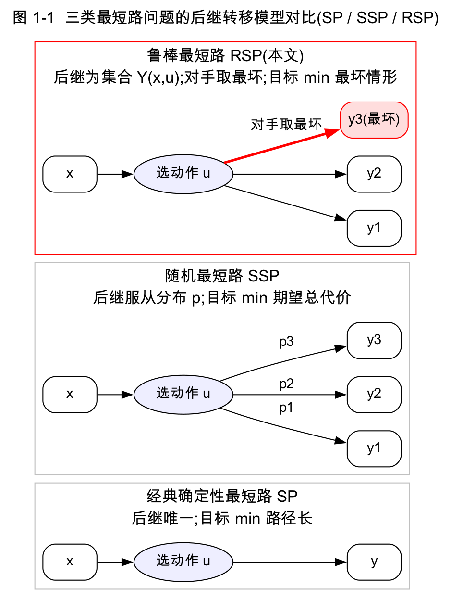

# 第一部分　引言与背景(草稿,可直接整理进 docx)

---

## 第 1 章　绪论

### 1.1 问题背景

最短路是运筹与人工智能中最基础的问题之一。但在许多实际场景中,"在节点 `x` 选动作 `u` 后会到达哪个后继"并非确定:它可能受环境、对手或建模不确定性影响。本项目复现的论文(D. P. Bertsekas, *Robust Shortest Path Planning and Semicontractive Dynamic Programming*, NRL 2019)研究的是其中**最坏情形(worst-case)** 视角:在每个节点选定动作后,后继由一个**对抗对手**从给定的不确定后继集合 `Y(x,u)` 中挑选最不利者。目标是找到一个策略,使得在**任何**对手选择下都能到达终点,且最坏累计代价最小。这类问题统称**鲁棒最短路(Robust Shortest Path, RSP)**。

论文 §1 列举了 RSP 的广泛应用:
- **运动规划与追逃(pursuit-evasion)**:追者要在逃者不可预测移动下保证抓捕,可建模为"地形图已知、逃者=对手"的 RSP;
- **模型预测控制(MPC)** 中的 set-membership 不确定性;
- **Markov 决策 / 序贯博弈** 的 minimax 版本;
- **鲁棒组合优化**;
- **HJB / eikonal 方程**离散化得到的大规模最短路。

### 1.2 与经典 / 随机最短路的区别

RSP 处于最短路谱系的"最坏情形"一端(详见第二部分表 6-1):

- **经典确定性最短路 SP**:后继唯一,目标 min 路径长;
- **随机最短路 SSP**:后继服从已知概率分布,目标 min **期望**总代价;
- **鲁棒最短路 RSP**:后继是集合 `Y(x,u)`,对手取最坏,目标 min **最坏情形**总代价(minimax)。

两个关键特征贯穿全文:(1) RSP 只在 **proper 策略**(保证对所有对手都到达终点)上最小化,因为"必达终点"是硬约束;(2) **min-max ≠ max-min**——对手知道我方在每个节点的决策,故"先 min 后 max"。

### 1.3 本次大作业任务

本项目的任务是**复现论文的算法体系并实证其理论**,具体包括:
1. 实现 minimax Bellman 算子、proper policy 判定与求值;
2. 实现三个核心求解器——**值迭代 VI、策略迭代 PI、Dijkstra-like**——以及 rollout 近似与三种 deterministic baseline、exhaustive ground-truth;
3. 构造满足论文假设的数据集(layered DAG)与验证失败模式的陷阱图族;
4. 完成三组实验(toy 正确性、中规模效率、鲁棒性对比)并做配对/多种子统计;
5. 提出工程与方法学层面的改进。

### 1.4 小组分工

| 成员 | 核心算法 | Baseline | 实验 | 主要文件 |
| --- | --- | --- | --- | --- |
| hhm | Dijkstra-like | Deterministic Dijkstra baselines | 实验 4 鲁棒性 | `dijkstra_like.*`、`baseline.*`、`experiments/` |
| lct | Value Iteration | Exhaustive search | 实验 3 效率、实验 4 robust VI | `value_iteration.*`、`exhaustive_search.*` |
| csy | Policy Iteration、proper policy、IO、整合 | rollout / 汇总 | 实验 1、报告与可视化 | `policy_iteration.*`、`proper_policy.*`、`io.*`、`visualization/`、`report/` |

所有成员通过统一接口(`include/rsp/`)对接,新增算法需在 `runner.cpp` 注册并同步 `docs/API.md`。

### 1.5 报告组织

第二部分解读论文与理论(建模、minimax/Bellman、半压缩 DP、Prop 4.1–4.3 及完整证明);第三部分给出四个算法的伪代码与收敛性;第四部分逐模块剖析 C++ 实现;第五部分讲数据集构造;第六部分分析实验结果;第七部分提出优化方法;第八部分总结展望;附录给公式↔代码对照、数据表与参考文献。

---

## 第 2 章　文献综述

### 2.1 经典确定性最短路

Dijkstra 算法(非负权)与 Bellman-Ford 算法(允许负权、检测负环)是最短路的基石;label-setting 与 label-correcting 是其统一框架(综述见 [Gallo-Pallottino 1988, 48];教材 [Ahuja et al., 2;Bertsekas, 28])。本文的 Dijkstra-like 算法正是把 Dijkstra 的"按非降序永久标号"思想推广到 minimax。

### 2.2 随机最短路(SSP)

SSP 把后继建模为概率转移,目标 min 期望总代价;Bertsekas-Tsitsiklis(1991, [19])给出了 proper policy 概念与收敛性分析,是 RSP "proper 策略"术语的来源。SSP 的 VI 有限终止需"最优策略下转移图无环"这一较强假设;论文指出 RSP 因最优策略必 proper(从而其转移图无环)而**天然**具有有限终止性。

### 2.3 鲁棒优化与博弈

鲁棒优化处理集合隶属不确定性下的最坏情形(Ben-Tal-El Ghaoui-Nemirovski [9];综述 Bertsimas et al. [5]);序贯 minimax/博弈见 [Başar-Bernhard 11;Filar-Vrieze 46];追逃问题见 [Guibas et al. 47;Parsons 68]。与既有鲁棒最短路工作([Bertsimas-Sim 17;Yu-Yang 87;Montemanni-Gambardella 63])的差别在于:本文把**每个节点的转移不确定性与其它节点解耦**,从而允许干净的 DP 表述。

### 2.4 半压缩抽象动态规划

本文的理论根基是 Bertsekas 的**抽象动态规划**,尤其是其中的**半压缩(semicontractive)模型**([Bertsekas, *Abstract Dynamic Programming*, 31];另见 [16,25,30])。半压缩模型介于压缩 DP(所有策略类压缩)与单调 DP 之间:只要求**部分策略**(此处即 proper)具有压缩样的 S-regularity 性质,坏策略(improper)则以无穷代价被排除。这一框架让 RSP 的存在唯一性、最优性、算法收敛性获得统一证明。

### 2.5 相关的 Dijkstra-type 博弈算法与本文新意

Bardi-Lopez([12])给出过动态博弈的 Dijkstra-type 算法,但收敛性分析较弱(且需严格正边权)。本文的贡献(也是本项目复现的重点):
1. 把 RSP 严格嵌入**半压缩抽象 DP**,给出 Bellman 方程解的**存在唯一性**与最优 proper 策略的存在性(Prop 4.3);
2. 给出 VI / PI 的收敛性与**有限终止**性质;
3. 给出一个**有限终止(N+1 步)、低阶多项式复杂度**的 Dijkstra-like 算法,适用条件比 [12] 更弱(允许零环、非严格正权);
4. 覆盖非负、零、负边权多种情形(假设 2.1 / 4.1 / 4.3 + 扰动法)。
