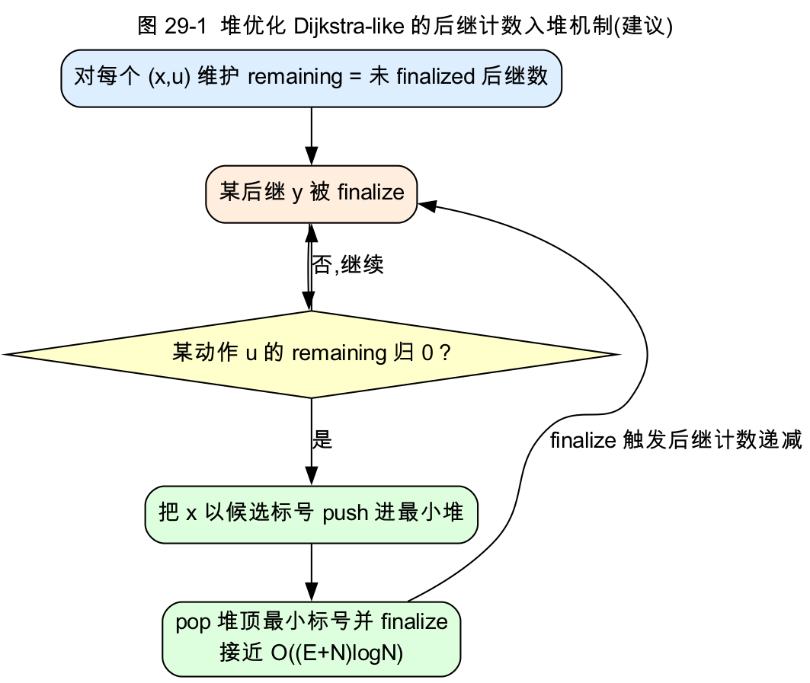
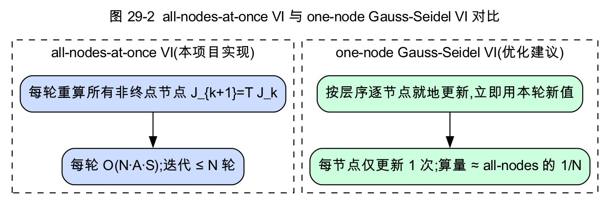

# 第七部分　优化与改进(草稿,可直接整理进 docx)

> 基于第六部分的观测,本部分从**算法、工程、方法学、理论延伸**四个层面提出改进。其中一部分(标注"已落实")是本次复现工程化中已实现的;另一部分(标注"建议")是有依据的进一步方向。

---

## 第 29 章　算法层面优化

### 29.1 Dijkstra-like 的堆优化(建议)

**现状**:项目实现是**扫描式**的——每轮遍历所有未永久化节点找全局最小候选,复杂度 `O(N²·A·S)`(第六部分实测 dijkstra 在 n=200 上慢于 vi 即源于此)。

**改进**:论文给出的复杂度上界是 `O(N·A·L)`。可用**二叉堆 / Fibonacci 堆**维护候选集 `V` 的最小标号选择(`argmin J`),把每轮 `O(N)` 的扫描降为 `O(log N)` 的弹出。难点在于:RSP 的更新条件是"某 action 的**全部**后继都已永久化"(`Y(x,u)⊂W`),不像经典 Dijkstra 那样一条边即可松弛——需为每个 `(x,u)` 维护"尚未永久化的后继计数",计数归零时才把该 action 的候选值入堆。这样可达到接近 `O((E+N)log N)` 的实际性能。

### 29.2 Gauss-Seidel(one-node-at-a-time)值迭代(建议)

**现状**:VI 用 all-nodes-at-once(`bellman_update` 整体重算,第六部分 vi 迭代数 4.7~7.6)。

**改进**:论文 §5.1 指出,按分层 `X₁,X₂,…` 的顺序**就地逐节点更新**(立即使用本轮已更新的值),则**每个节点只需更新一次**,迭代算量约降为 all-nodes 的 `1/N`(论文 Fig 4 实例:同为 4 步收敛,但 one-node 版每步算量少 N 倍)。实现上只需把 `bellman_update` 改为原地更新并按拓扑/层序遍历。

### 29.3 乐观 / 异步策略迭代(建议)

**现状**:PI 需已知初始 proper 策略(`find_initial_proper_policy`),且严格同步。

**改进**:论文 §5.2 的带阈值函数 `V` 的乐观 PI(式 5.6/5.7)可**容忍 improper 中间策略**、支持分布式异步与 one-node Gauss-Seidel,适合无初始 proper 策略或并行环境。代价是需额外维护 `V` 作为收敛阈值。

### 29.4 Rollout 在线近似(建议)

对**超大规模**图,不必求全局 `J*`:取一个易得的 base policy `μ`,用单步改进的 rollout 策略 `μ̄`(式 5.19)在线决策,理论保证 `J_μ̄ ≤ J_μ`(第三部分 §10.2)。适合实时追逃等场景(论文 §5.4)。

### 29.5 VI 微优化(已落实)

- `bellman_update` 改为**单遍**求 min(去掉对最优 action 的二次 `action_value` 计算);
- `value_history` 默认关闭(从不导出,省 `O(iters·N)` 分配)。

---

## 第 30 章　工程层面优化(本次复现已落实)

这些是把"能跑的复现"提升为"工程级可靠复现"的改进,均已在 `red` 分支实现并通过测试。

### 30.1 健壮性

- **exhaustive 规模守卫**:策略数 > 5e6 或 n > 2000 时返回 `success=false`,消除 CLI 跑大图时的**永久卡死 / 深图栈溢出**(与全代码"优雅失败"哲学一致)。
- **读图校验**:拒绝尾部多余 token(防损坏/拼接文件被静默当成另一张图)、`n` 上限防 OOM、`cost < 5e99`(防与 `INF` 哨兵冲突)、节点内 `action_id` 唯一。
- **graceful failure 统一**:`policy_iteration` 在"无初始 proper / 改进后 improper"时优雅返回 `success=false`,与 vi/dijkstra 一致(不再抛异常中断批处理)。
- **CSV 字段 RFC4180 转义**:`graph_id`/`algorithm` 含逗号不再破格。

### 30.2 构建与 CI

- CMake 默认 Release(让 README 命令复现 Release runtime);GNU/Clang 旗标加守卫 + MSVC 支持;新增 `RSP_WERROR`。
- CI:`ubuntu+macos` 矩阵(顺带覆盖 gcc + AppleClang)、`-Werror` 严格 job、smoke 增加数值断言。

### 30.3 测试

新增:300 张随机图上 `vi=pi=dijkstra=exhaustive` 与 `zero-init=inf-init` 一致性、rollout 超时分支、exhaustive 规模守卫与无-proper 情形、PI 改进+历史断言、runner 派发数值校验——把"算法正确性不变量"固化为回归测试。

---

## 第 31 章　方法学层面优化

### 31.1 已落实

- **陷阱图族**:展示 baseline 真正失效(第六部分 §27.1);
- **配对(逐图)统计**:VI 对每个 baseline 100/100 不劣,比"均值更低"更强;
- **多种子稳定性**:seed 42/123/2024,VI 配对胜率 900/900。

### 31.2 建议

- **负环 / 零环图族**:当前数据为非负边权 layered DAG(假设 4.3)。可补一类含**负环**的图(对应假设 4.1,longest-path 视角)与含**零环**的图(用扰动法 Prop 4.5 求解),完整覆盖论文的三类假设。
- **置信区间**:对 `avg_worst_cost` 等给出 bootstrap 95% CI;对配对胜率给出符号检验 p 值(VI 0/300 落败对应 p ≈ 1.9e-6)。
- **更大规模 / 真实数据**:在堆优化(§29.1)后扩到 `n ≥ 10³`;引入真实地图(追逃)数据。

---

## 第 32 章　理论延伸(论文 §6)

论文结尾给出几个可作为未来方向的扩展:

- **随机扩展**(式 6.1):在每个节点先选控制 `u`、再由随机变量 `z` 以概率 `p_xz(u)` 触发不同的对抗后继集——把 RSP 与 SSP 混合,算子改为 `H(x,u,J) = Σ_z p_xz(u) max_{y∈Y_z(x,u)}[g+J̃(y)]`。这同样可用半压缩框架分析,是 RSP 向"部分随机 + 部分对抗"的自然推广。
- **负边权 longest-path**:当所有边权非负且 `TJ̄ ≥ J̄` 时,可用单调增 DP(负 DP)的另一条分析线,处理"最长路 / 价值搜索"型问题(论文 §6)。
- **不完美状态信息**:用 set-membership estimator 的"充分信息函数"把不完美观测 RSP 归约为完美状态信息 RSP(论文 §1.1,[15,24]),适用于传感受限的追逃。

---

## 第七部分小结

算法层面,堆优化的 Dijkstra-like、Gauss-Seidel VI、乐观 PI、rollout 是论文指明、性能可期的方向;工程与方法学层面,本次复现已把健壮性、构建/CI、测试、陷阱图/配对/多种子统计落到实处;理论层面,随机扩展与负权/不完美信息是 RSP 框架的自然延伸。这些共同把一个"复现实现"推向"工程可靠 + 科学严谨 + 可继续研究"的状态。
