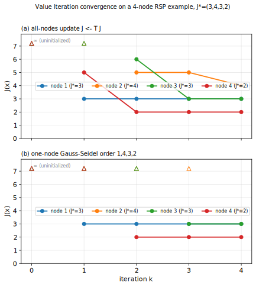
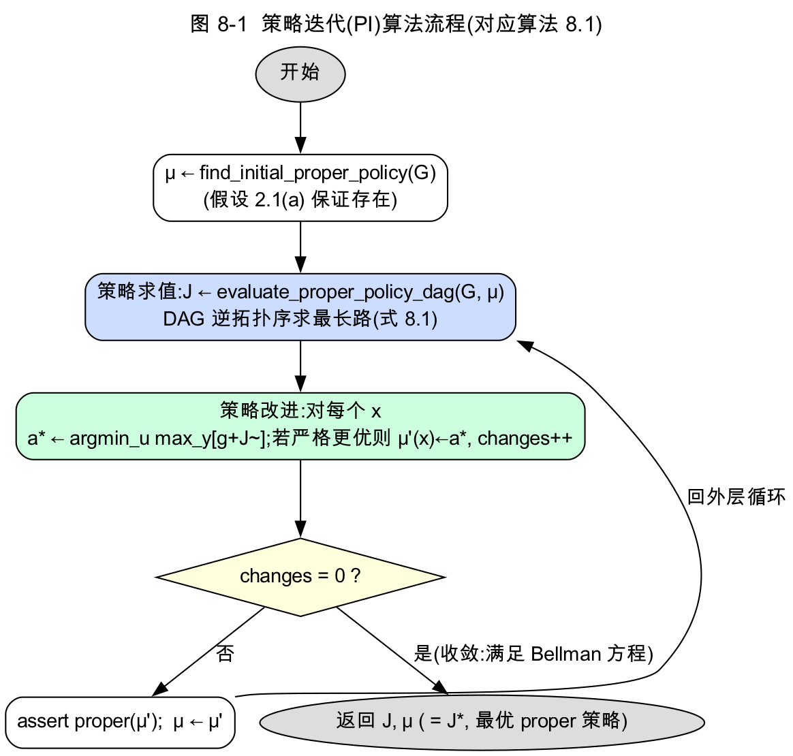
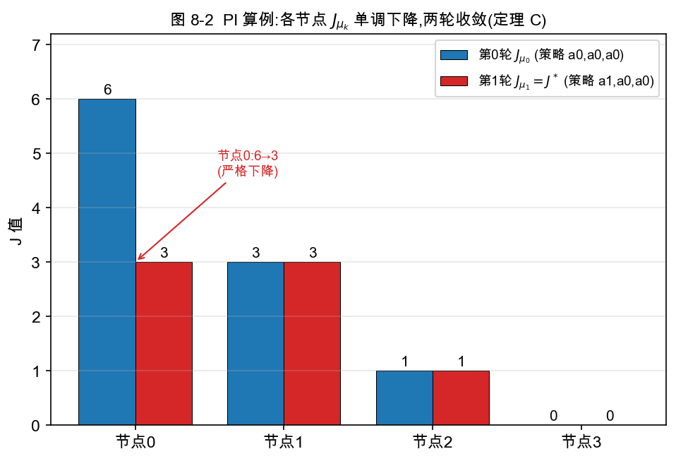
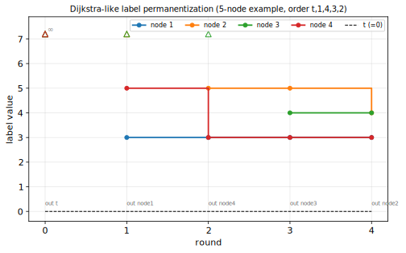
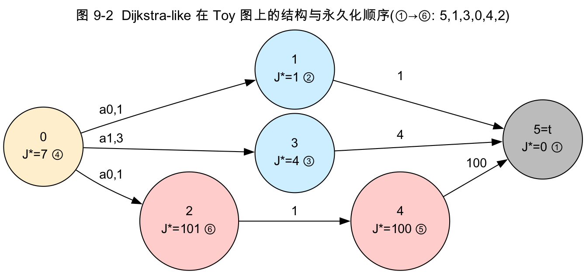

# 第三部分　算法(草稿,可直接整理进 docx)

> 第二部分已证:在假设 2.1(或非负边权下的 4.3)下,`J*` 是 Bellman 算子 `T` 在 `R(X)` 内的唯一不动点,最优策略必 proper,且 `T^k J → J*`。本部分给出复现的四个算法——**值迭代 VI、策略迭代 PI、Dijkstra-like、Rollout**——的数学描述、伪代码、收敛性(引用第二部分定理 A/B/C)、复杂度与论文示例(Fig 4/5)。**具体 C++ 实现见第四部分**。

---

## 第 7 章　值迭代(Value Iteration, VI)

### 7.1 算法思想

VI 直接迭代 Bellman 最优算子:从某初值 `J₀` 出发,反复令 `J_{k+1} = T J_k`,即对每个非终点节点同时做一次 "先 min 动作、后 max 后继" 的更新:

> (7.1)　`J_{k+1}(x) = min_{u∈U(x)} max_{y∈Y(x,u)} [ g(x,u,y) + J̃_k(y) ]`,　`J_k(t) ≡ 0`。

由命题 4.3(c),`T^k J → J*` 对一切 `J ∈ R(X)`;特别地,从 `J₀ ≡ ∞` 出发收敛到 `J*`,且(定理 A)**有限步终止**。

### 7.2 伪代码(all-nodes-at-once)

```
算法 7.1　值迭代 VI(all-nodes-at-once)
输入:图 G=(X∪{t}, U, Y, g),阈值 ε,最大迭代 max_iter,init_with_inf
输出:J ≈ J*,贪心策略 μ
 1  J(t) ← 0;  对所有 x∈X:  J(x) ← (+∞ 若 init_with_inf 否则 0)
 2  for iter = 1 .. max_iter:
 3      for x ∈ X:                                  # 用上一轮的 J(同步更新)
 4          J'(x) ← min_{u∈U(x)} max_{y∈Y(x,u)} [ g(x,u,y) + J̃(y) ]
 5      residual ← max_{x∈X} finite_diff( J'(x), J(x) )    # 见 4.x:INF-安全的差
 6      J ← J'
 7      if residual 有限 且 residual < ε:  break          # 收敛
 8  for x ∈ X:  μ(x) ← argmin_{u} max_{y} [ g + J̃(y) ]    # 抽取贪心策略
 9  return J, μ
```

第 5 行的 `finite_diff` 对应项目 `finite_abs_diff`:两端都为 `∞` 时记差为 0(不可达节点不阻碍收敛),仅一端为 `∞` 时记为 `∞`(收敛判据要求残差有限,见第 7 行 `residual 有限`)。

### 7.3 收敛性与有限终止

- **收敛**:命题 4.3(c),`T^k J → J*`。
- **有限终止**(第二部分**定理 A**):从 `J₀≡∞` 出发,VI 按分层集合 `X₀={t}, X₁, X₂, …`(式 5.1)逐层确定各节点的 `J*`;到第 `k̄` 层(`∪X_m = X∪{t}`)即得 `J*`,迭代步数 `= k̄ ≤ N`,类似 Bellman-Ford。
- 第 7.x 节的 toy 算例(第二部分 §4.5)给出了具体迭代表:`X₀={5}, X₁={1,3,4}, X₂={0,2}`,2 步收敛。

### 7.4 Gauss-Seidel(one-node-at-a-time)变体

论文 §5.1 指出 all-nodes-at-once VI 类似 Bellman-Ford,可用**就地更新(Gauss-Seidel)**改进:按一个有利顺序逐节点更新,并立即使用本轮已更新的值。最优顺序就是分层集合 `X₁, X₂, …` 的顺序——此时**每个节点只需更新一次**。

> **图 7-1(对照论文 Fig 4)**　一个 4 节点 RSP 例子,`X={1,2,3,4}`,最优值 `J*=(3,4,3,2)`。两种 VI 都在 4 步收敛,但 one-node 版每步算量约为 all-nodes 版的 `1/N`:
>
> | 迭代 | all-nodes `J=T J` | one-node(顺序 1,4,3,2) |
> | ---: | --- | --- |
> | 0 | (∞,∞,∞,∞) | (∞,∞,∞,∞) |
> | 1 | (3,∞,∞,5) | (3,∞,∞,∞) |
> | 2 | (3,5,6,2) | (3,∞,∞,2) |
> | 3 | (3,5,3,2) | (3,∞,3,2) |
> | 4 | (3,4,3,2)=J* | (3,4,3,2)=J* |



本项目实现的是 all-nodes 版(`bellman_update` 整体重算);Gauss-Seidel 列为优化方向(第七部分 §29)。

### 7.5 复杂度

每轮对每个非终点节点、每个动作、每个后继做常数工作:`O(N · A · S)`(`N` 节点、`A` 平均动作数、`S` 平均后继数);迭代 `≤ N` 轮 ⟹ 总 `O(N² · A · S)`。

▶ **对应实现**:`src/value_iteration.cpp`(第 15 章);核心一步 `bellman_update` 在 `src/bellman.cpp`(第 13 章)。

---

## 第 8 章　策略迭代(Policy Iteration, PI)

### 8.1 算法思想

PI 在 **proper 策略空间**内迭代:从一个初始 proper 策略 `μ₀` 出发,交替执行
- **策略求值**:精确求当前策略的 `J_{μk}`(在无环子图 `A_{μk}` 上按逆拓扑序求最长路);
- **策略改进**:对每个节点选更优动作 `μ_{k+1}(x) = argmin_u max_y [g + J̃_{μk}(y)]`。

由**定理 C**,`{J_{μk}}` 逐点单调非增,有限步内到 `J*`,且每个 `μk` 都 proper。

### 8.2 伪代码

```
算法 8.1　策略迭代 PI
输入:图 G
输出:J*,最优 proper 策略 μ
 1  μ ← find_initial_proper_policy(G)        # 假设 2.1(a) 保证存在
 2  repeat (至多 max_outer_iter 次):
 3      J ← evaluate_proper_policy_dag(G, μ)  # = J_μ,DAG 逆拓扑最长路(8.3)
 4      changes ← 0;  μ' ← μ
 5      for x ∈ X:
 6          a* ← argmin_{u∈U(x)} max_{y∈Y(x,u)} [ g + J̃(y) ]
 7          if 严格优于 μ(x)（差 > ε）:  μ'(x) ← a*;  changes++
 8      if changes = 0:  return J, μ          # 收敛(μ 满足 Bellman 方程)
 9      assert proper(μ')                      # 理论保证;违反则优雅失败
10      μ ← μ'
11  return evaluate_proper_policy_dag(G, μ), μ
```



### 8.3 策略求值:DAG 最长路

对 proper `μ`,`A_μ` 无环,故存在拓扑序。`J_μ` 满足
> (8.1)　`J_μ(x) = max_{y∈Y(x,μ(x))} [ g(x,μ(x),y) + J̃_μ(y) ]`，
按**逆拓扑序**(从靠近终点的节点开始)回代即可精确求得(对应 §3.4 的"最长路"定义)。

### 8.4 单调收敛(定理 C 回顾)

- 改进不增:`J_{μk} = T_{μk}J_{μk} ≥ T J_{μk} = T_{μ_{k+1}}J_{μk} ≥ J_{μ_{k+1}}`(式 5.5);
- 保持 proper:由假设 2.1(b) + 命题 4.1(d),改进自 proper 不会变 improper;
- proper 策略有限 + 单调严格下降 ⟹ 有限步终止于 `J*`。

### 8.5 乐观 / 异步 PI(论文 §5.2)

朴素 PI 需要已知初始 proper 策略,且异步实现下难保证中间策略都 proper。论文给出带**阈值函数 `V`** 的乐观 PI(式 5.6/5.7):额外维护 `V`,以 `min[V_k, J_k]` 为界,使算法即便经过 improper 中间策略也保持有界收敛;并支持 one-node Gauss-Seidel、分布式异步执行。列为优化方向(第七部分 §29)。

### 8.6 算例:PI 在一张小图上的一轮改进

取 4 节点小图(终点 `3`):节点 0:`a0={1(1.0),2(5.0)}, a1={2(2.0)}`;节点 1:`a0={3(3.0)}, a1={3(4.0)}`;节点 2:`a0={3(1.0)}, a1={3(2.0)}`。

| 轮 `k` | 当前策略 `μ_k` | 求值 `J_{μ_k}`(节点 0,1,2,3) | 改进动作 | `changes` |
| ---: | --- | --- | --- | ---: |
| 0 | (a0, a0, a0) | (**6**, 3, 1, 0) | 节点 0:`a0`(值 6)→ `a1`(值 3) | 1 |
| 1 | (**a1**, a0, a0) | (**3**, 3, 1, 0) | 无 | 0 → 收敛 |



- 第 0 轮:初始 proper 策略在节点 0 选便宜的 `a0`,但其后继 `{1,2}` 的最坏分支(`2`,代价 5)使 `J(0)=max(1+3, 5+1)=6`;改进发现 `a1`(经 `2`,代价 2)给出 `2+J(2)=3` 更优。
- 第 1 轮:重新求值得 `J(0)=3`;再改进无变化,`changes=0`,收敛。`J*=[3,3,1,0]`,最优 `policy[0]=a1`。

`J_{μ_0} ≥ J_{μ_1}`(6 ≥ 3,逐点不增)正是定理 C 的单调下降;两轮终止印证有限收敛。该图与 exhaustive 结果一致(`tests/test_lct.cpp::test_policy_iteration_improves_over_initial_proper_policy`)。

▶ **对应实现**:`src/policy_iteration.cpp`(第 16 章);求值在 `src/proper_policy.cpp::evaluate_proper_policy_dag`(第 14 章)。

---

## 第 9 章　Dijkstra-like 算法

### 9.1 适用假设

> **假设 5.1**　(a) 存在 proper 策略;(b) 每个 improper 策略的所有环长为正;(c) **所有边权非负**。

(a)(b) 即假设 2.1;(c) 的非负性提供了"最小标号即最终值"的 Dijkstra 式结构。

### 9.2 算法思想

维护永久集 `W`(已确定 `J*` 的节点)、候选集 `V`、标号 `J`。每轮把当前标号最小的候选 `y*` 永久化;一个动作只有当其**全部后继都已永久化**(`Y(x,u) ⊂ W`)时才可用于更新该节点。因边权非负,被永久化的最小标号即该节点的最终最优值(定理 B)。

> (9.1)　可用动作集 `Û(x) = { u∈U(x) | Y(x,u) ⊂ W ∪ {y*} 且 y* ∈ Y(x,u) }`;
> (9.2)　更新 `J(x) ← min[ J(x),  min_{u∈Û(x)} max_{y∈Y(x,u)} (g(x,u,y) + J(y)) ]`。　[式 5.9/5.10]

### 9.3 伪代码

```
算法 9.1　Dijkstra-like(论文 §5.3 的 V/W 版)
输入:非负边权图 G
输出:J = J*
 1  J(t) ← 0;  J(x) ← +∞ (∀x∈X);  V ← {t};  W ← ∅
 2  while V ≠ ∅:
 3      y* ← argmin_{y∈V} J(y);  V ← V\{y*};  W ← W∪{y*}     # 永久化最小标号
 4      for x ∉ W:
 5          Û(x) ← { u∈U(x) | Y(x,u) ⊂ W 且 y*∈Y(x,u) }
 6          if Û(x) ≠ ∅:
 7              cand ← min_{u∈Û(x)} max_{y∈Y(x,u)} [ g(x,u,y) + J(y) ]
 8              if cand < J(x):  J(x) ← cand;  V ← V∪{x}      # 进入候选
 9  return J
```

> 项目实现采用等价的**扫描式**变体:每轮扫描所有未永久化节点,对"全部后继已永久化"的动作算候选值,取**全局最小**者永久化(故复杂度为 `O(N²·A·S)` 而非堆优化的 `O(NAL)`)。两者结果相同。

### 9.4 终止与正确性(定理 B 回顾)

- **恰 N+1 轮终止**(命题 B2,反证):若提前终止,剩余节点集 `V̄` 中每点都有一条出边留在 `V̄` ⟹ `V̄` 含环 ⟹ 与 proper 策略 `A_μ̄` 无环矛盾。
- **非降序永久化**(引理 B1):节点按 `J` 非降序进入 `W`,故最小标号已是最终值。
- **正确性** `J=J*`(命题 5.3):与经典 Dijkstra 同构,把"最短路"换成 (9.2) 的 minimax `min_u max_y`。

### 9.5 复杂度与示例

- 复杂度 `O(N·A·L)`(`L=|U|`),用堆选 `argmin` 可进一步优化(第七部分 §29)。

> **图 9-1(对照论文 Fig 5)**　对一个 5 节点例子,节点出 `V`(永久化)的顺序为 `1, 4, 3, 2`,标号逐轮收敛:
>
> | 轮 | `V`(轮初) | 标号(轮初) | 出 V 的 `y*` |
> | ---: | --- | --- | :---: |
> | 0 | {t} | (∞,∞,∞,∞,0) | t |
> | 1 | {1,4} | (3,∞,∞,5,0) | 1 |
> | 2 | {2,4} | (3,5,∞,3,0) | 4 |
> | 3 | {2,3} | (3,5,4,3,0) | 3 |
> | 4 | {2} | (3,4,4,3,0) | 2 |



### 9.6 算例:Dijkstra-like 在 Toy 图上的永久化顺序

对 toy 图(§20.2),逐轮取标号最小的可永久化节点:

| 轮 | 永久集 `W`(轮初) | 可永久化候选(节点:动作 → 候选值) | 选中 `y*` | 永久化值 |
| ---: | --- | --- | :---: | ---: |
| init | {5} | — | 5 | `J(5)=0` |
| 1 | {5} | 1:`a0`→1,　3:`a0`→4,　4:`a0`→100 | **1** | `J(1)=1` |
| 2 | {5,1} | 3:`a0`→4,　4:`a0`→100 | **3** | `J(3)=4` |
| 3 | {5,1,3} | 0:`a1`→3+`J`(3)=7,　4:`a0`→100 | **0** | `J(0)=7`(选 `a1`) |
| 4 | {5,1,3,0} | 4:`a0`→100 | **4** | `J(4)=100` |
| 5 | {5,1,3,0,4} | 2:`a0`→1+`J`(4)=101 | **2** | `J(2)=101` |

永久化顺序 `5,1,3,0,4,2`,结果 `value=[7,1,101,4,100,0]=J*`。注意第 3 轮:节点 0 的 `a0={1,2}` 因后继 `2` 尚未永久化而不可用,只能经 `a1={3}` 永久化为 7——这正体现了"某动作的全部后继都已永久化(`Y(x,u)⊂W`)才可用"。该顺序与 `tests/test_hhm.cpp` 断言的 `finalize_order={5,1,3,0,4,2}` 一致,也印证引理 B1(非降序永久化:`0<1<4<7<100<101`)。



▶ **对应实现**:`src/dijkstra_like.cpp`(第 17 章)。

---

## 第 10 章　Rollout 近似求解

### 10.1 算法思想

当图规模极大、`J*` 求解昂贵时,可用 **rollout**:给定一个**基策略(base policy)** `μ`(proper),其值 `J_μ` 可在线/离线算出,定义 **rollout 策略**

> (10.1)　`μ̄(x) ∈ argmin_{u∈U(x)} max_{y∈Y(x,u)} [ g(x,u,y) + J̃_μ(y) ]`,　`x ∈ X`。　[式 5.19]

这恰是对基策略 `μ` 做**单步 PI 改进**。

### 10.2 改进性质

> **命题(rollout 改进)**　`J_μ̄(x) ≤ J_μ(x)`,∀ `x∈X`,且 `μ̄` proper。

**证明**:由 (10.1),`(T_μ̄ J_μ)(x) = min_u max_y[g+J̃_μ(y)] ≤ max_y[g(x,μ(x),y)+J̃_μ(y)] = (T_μ J_μ)(x) = J_μ(x)`。即 `T_μ̄ J_μ ≤ J_μ`;反复作用单调的 `T_μ̄` 得 `J_μ̄ = lim_m T_μ̄^m J_μ ≤ J_μ`,且(同定理 C 第 2 步)`μ̄` proper。∎

### 10.3 应用

论文 §5.4 以**追逃问题**为例:基策略取"追者沿到逃者当前位置的最短路"(可由全源最短路 `O(N³)` 预计算),rollout 在线对每个 `u`、`y` 算 `max[g+J̃_μ]` 即可——适合实时、数据在线变化的场景。

▶ **对应实现**:项目的 `adversarial_rollout`(`src/baseline.cpp`,第 18 章)即沿固定策略让对手每步取 `max[g+J̃]` 的 rollout,用于实验 4 比较各策略的最坏代价。

---

## 第三部分小结

VI / PI / Dijkstra-like 三者在假设 2.1(Dijkstra-like 再加非负边权)下都正确收敛到同一个 `J*`(第二部分定理 A/B/C),区别在迭代结构与复杂度(表 6-2);rollout 则以单步改进给出大规模问题的次优在线解。下一部分逐一剖析它们在项目中的 C++ 实现,并把每段代码钉回本部分的伪代码与第二部分的公式。
