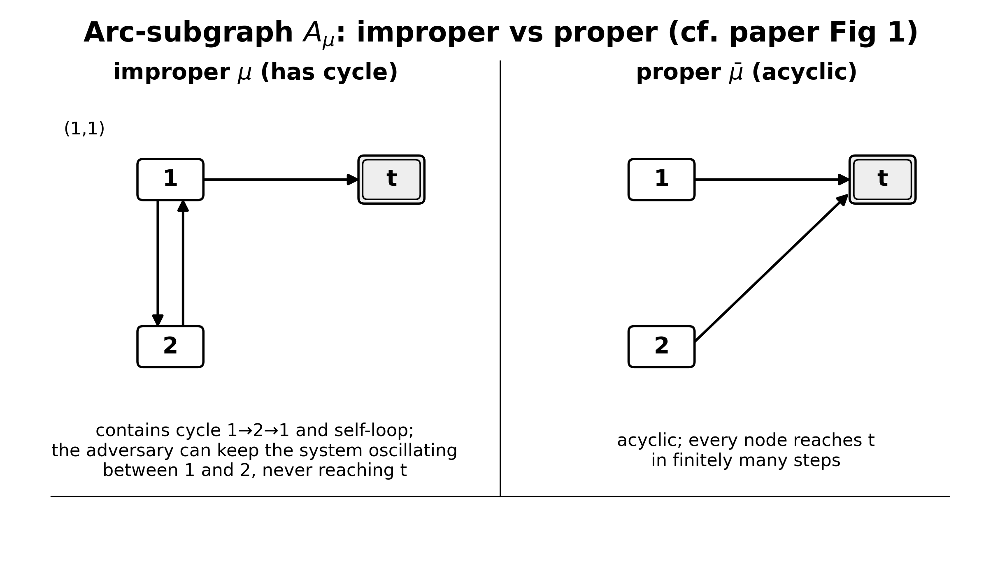
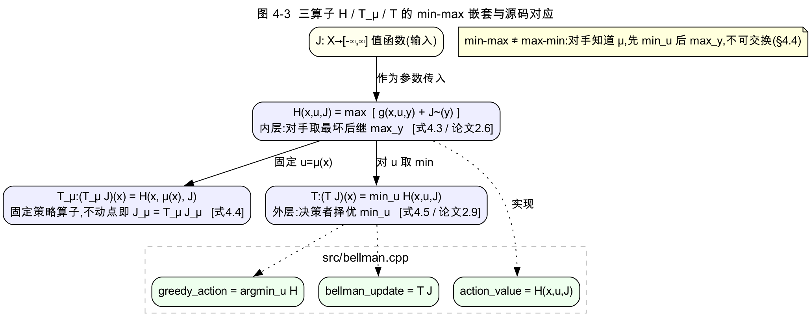
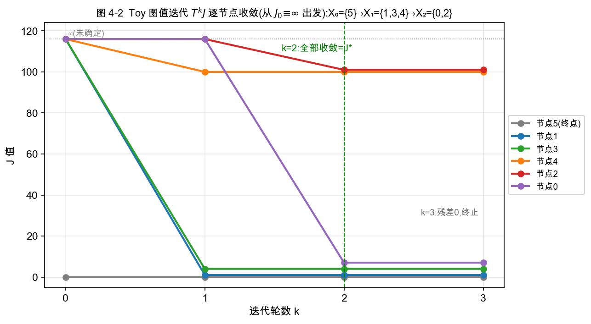
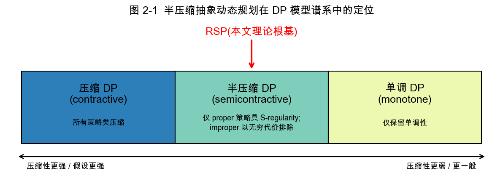
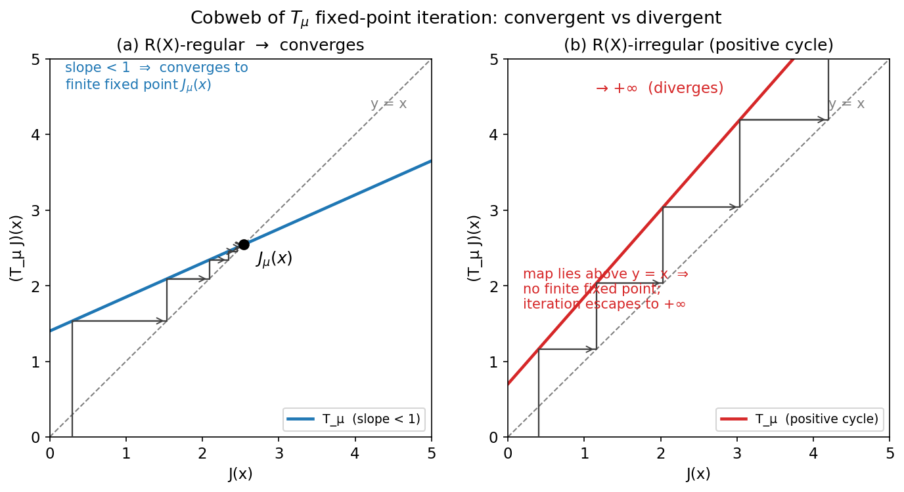
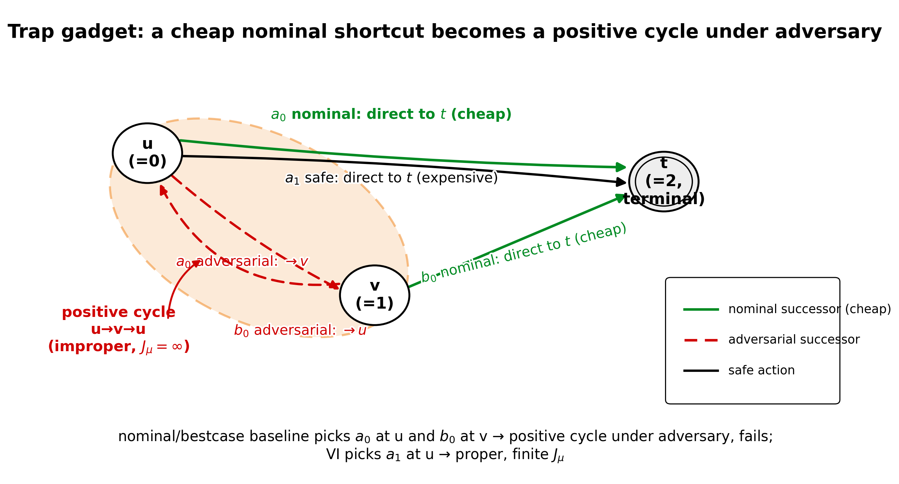

# 第二部分　论文解读与理论(草稿,可直接整理进 docx)

> 对应论文:D. P. Bertsekas, *Robust Shortest Path Planning and Semicontractive Dynamic Programming*, Naval Research Logistics 66:15–37, 2019。
> 本部分公式自带本报告编号 (3.x)/(4.x)/…,括注的"[式 2.6]"为论文原编号,便于对照。
> 每节末「▶ 与本项目的对应」把理论落到我们 `red` 分支源码上。

---

## 第 3 章　鲁棒最短路问题建模

### 3.1 图、控制与对抗后继

考虑一个有向图,节点集为 `X ∪ {t}`,其中 `X` 是有限的普通节点集,`t` 是一个特殊节点,称为**终点(destination)**。有向弧集记为

> (3.1)　`A ⊂ { (x, y) | x ∈ X, y ∈ X ∪ {t} }`。　[式见 §1.2]

终点 `t` 是**吸收且零代价**的:从 `t` 出发只有自环 `(t, t)`,且对所有 `u` 有 `g(t, u, t) = 0`。

与经典最短路不同,RSP 在每个节点的"后继"不是唯一确定的:

- 在节点 `x ∈ X`,决策者从一个非空的**控制集** `U(x) ⊂ U`(`U` 有限)中选择一个控制(动作)`u`;
- 选定 `u` 后,后继节点 `y` 由一个**对抗对手(antagonistic opponent)** 从非空的**不确定后继集** `Y(x, u) ⊂ X ∪ {t}` 中选取,其中要求 `(x, y) ∈ A` 对所有 `y ∈ Y(x, u)` 成立;
- 转移产生代价 `g(x, u, y)`。

这种不确定性是**集合隶属(set-membership)** 型的:我们只知道后继落在集合 `Y(x, u)` 内,而对手会挑对我们最不利的那个。这与随机最短路(SSP)中"后继服从已知概率分布"不同——RSP 取的是**最坏情形(worst case)**,而非期望。

### 3.2 策略、路径与策略代价

一个**策略(policy)** `μ` 是一个函数,为每个 `x ∈ X` 指定控制 `μ(x) ∈ U(x)`。由于 `X`、`U(x)` 有限,策略的全体 `M` 也有限。

给定 `μ` 与起点 `x₀`,一条**路径** 是弧序列

> (3.2)　`p = { (x₀, x₁), (x₁, x₂), … }`,其中 `x_{k+1} ∈ Y(x_k, μ(x_k))` 对所有 `k ≥ 0`。

`μ` 下从 `x₀` 出发的所有路径集合记为 `P(x₀, μ)`——这是对手在 `μ` 固定后所有可能生成的路径。路径长度定义为

> (3.3)　`L_μ(p) = Σ_{k=0}^∞ g(x_k, μ(x_k), x_{k+1})`(若级数收敛),否则 `L_μ(p) = limsup_{m→∞} Σ_{k=0}^m g(...)`。　[式 1.1]

若路径在有限步到达终点,即 `p = {(x₀,x₁), …, (x_{m-1}, t), (t,t), …}` 且 `x₀,…,x_{m-1}` 是互不相同的非终点节点(称为**终止路径(terminating path)**),则由 `g(t,u,t)=0`,其长度就是前 `m` 段之和:

> (3.4)　`L_μ(p) = Σ_{k=0}^{m-1} g(x_k, μ(x_k), x_{k+1})`。

### 3.3 proper 与 improper 策略

刻画一个策略 `μ` 的关键是它诱导的**弧子图**

> (3.5)　`A_μ = ∪_{x∈X} { (x, y) | y ∈ Y(x, μ(x)) }`。　[式见 §1.2]

注意 `A_μ` 收集的是 `μ` 在每个节点所选控制下**对手所有可能后继**对应的弧——因为对手可以选其中任意一个。`A_μ` 连同自环 `(t,t)` 恰好包含了 `∪_x P(x, μ)` 中所有路径。

- 若 `A_μ` **无环(acyclic)**(除自环 `(t,t)` 外不含任何环),则称 `μ` 是 **proper** 的。等价地:`A_μ` 中所有路径都是简单的、有限步终止的;再等价地:`A_μ` 是 destination-connected(每个节点都能到 `t`)且无环。
- 否则(`A_μ` 含环)称 `μ` 是 **improper** 的。

直觉:**proper 策略保证无论对手如何选后继,系统都在有限步内到达终点**;improper 策略下对手可以让系统永远在某个环里打转、不达终点(论文 Fig 1 给出同一图上一个 improper `μ`(含环 `(1,2,1)` 与自环 `(1,1)`)与一个 proper `μ̄` 的对照)。

> **图 3-1(对照论文 Fig 1,建议绘制)**　同一图、`X = {1,2}`、终点 `t`,两个策略诱导的弧子图 `A_μ`:
>
> 
>
> 左:`A_μ` 含环 `(1,2,1)`,对手可让系统在 1、2 间往返不达 `t`,故 improper;右:`A_μ̄` 无环,每个节点都达 `t`,故 proper。

> 「proper」一词沿用随机最短路:在 SSP 中 proper 指"以概率 1 到达终点"的策略;在 RSP 的对抗语义下,它强化为"对所有对手选择都到达终点"。

### 3.4 策略的最坏情形代价 J_μ

对一个 proper 策略 `μ`,定义它在节点 `x` 的**最坏情形路径长度**为

> (3.6)　`J_μ(x) = max_{p ∈ P(x, μ)} L_μ(p)`,　`x ∈ X`。　[式 1.2 / 2.1]

由于 `A_μ` 无环且路径有限,`P(x,μ)` 中路径数有限,故 `J_μ(x)` 是 `A_μ` 这张有向无环图(DAG)上**从 x 到 t 的最长路(longest path)**。它可由枚举比较所有路径得到,或把弧长取反后求最短路得到。

对一般(可能 improper)的 `μ`,把定义推广为

> (3.7)　`J_μ(x) = limsup_{k→∞} sup_{p ∈ P(x,μ)} L_p^k(μ)`,　[式 2.2]

其中 `L_p^k` 是路径 `p` 前 `k` 段弧的长度和。当 `μ` proper 时 (3.7) 与 (3.6) 一致;当 `μ` improper 时 `J_μ(x)` 可能取 `+∞`(见第 6 章 Prop 4.1)。

▶ **与本项目的对应**:`J_μ` 的定义 (3.6) 正是我们 `src/proper_policy.cpp::evaluate_proper_policy_dag` 的语义——它按 `A_μ` 的**逆拓扑序**回代 `J(x) = max_{y∈Y(x,μ(x))} [g(x,μ(x),y) + J(y)]`,即在 DAG 上自终点向起点求最长路。`max` 体现"对手取最坏后继",`min`(择优动作)在 (4.x) 的算子里。

### 3.5 RSP 问题与基本假设

**鲁棒最短路问题(RSP)** 是:在所有 proper 策略上求一个**最优 proper 策略 `μ*`**,使得 `J_{μ*}(x)` 对每个 `x ∈ X` **同时**最小:

> (3.8)　对所有 `x`,`J_{μ*}(x) = min_{μ proper} J_μ(x)`。

这与经典最短路平行,但**只在 proper 策略上最小化**——因为"必须到达终点"是 RSP 的硬性要求。论文同时考虑其 minimax 版本(在**所有**策略上最小,见 (4.x) 式 2.5),并将证明二者在下述假设下一致。

> **假设 2.1**　(a) 至少存在一个 proper 策略;(b) 对每个 improper 策略 `μ`,`A_μ` 中所有环的长度均为**正**。

假设 2.1 平行并推广了经典确定性最短路的典型假设:(a) 每个节点都能连到终点;(b) 图中所有有向环长为正(无负环、无零环)。条件 (a) 保证 RSP 有可行解;条件 (b) 保证 improper 策略代价无穷大、从而不会成为最优(见第 6 章)。论文还在 §4 给出更弱的假设(4.1/4.2/4.3),把"正环"放宽为"非负环",特别适用于**所有边权非负**的常见情形。

▶ **与本项目的对应**:我们的图生成器 `experiments/generate_medium_graphs.py` 用 **layered DAG**(每条弧只指向更后的层或终点)保证 `A_μ` 永远无环——既满足假设 2.1(a)(强制每个非终点节点有一条 "safe" 动作通向后续层),又因边权取 `[1,20]` 非负而满足假设 4.3。`src/graph.cpp::validate()` 强制 `cost ≥ 0`,正是落实"非负边权"这一前提。

---

## 第 4 章　Minimax 形式与 Bellman 方程

### 4.1 三个核心算子 H、T_μ、T

把 (3.6) 写成递归形式,即得到固定策略 `μ` 的 **Bellman 方程**:

> (4.1)　`J_μ(x) = max_{y ∈ Y(x, μ(x))} [ g(x, μ(x), y) + J̃_μ(y) ]`,　`x ∈ X`,　[式 2.3]

其中 `J̃` 是把终点值固定为 0 的"补全":

> (4.2)　`J̃(y) = J(y)`(若 `y ∈ X`)，`J̃(y) = 0`(若 `y = t`)。　[式 2.4/2.7]

为把问题嵌入抽象动态规划框架,论文引入三个作用在值函数 `J: X → [-∞, ∞]` 上的算子:

- **后继代价算子** `H`(给定状态 `x`、控制 `u`、值函数 `J`):
  > (4.3)　`H(x, u, J) = max_{y ∈ Y(x, u)} [ g(x, u, y) + J̃(y) ]`。　[式 2.6]
  它是"在 `x` 选 `u`、对手取最坏后继"的一步代价。

- **固定策略算子** `T_μ`:
  > (4.4)　`(T_μ J)(x) = H(x, μ(x), J)`,　`x ∈ X`。　[式 2.8]
  其不动点方程 `J_μ = T_μ J_μ` 即 Bellman 方程 (4.1)。

- **最优算子** `T`:
  > (4.5)　`(T J)(x) = min_{u ∈ U(x)} H(x, u, J) = min_{μ ∈ M} (T_μ J)(x)`,　`x ∈ X`。　[式 2.9/2.10]

`T` 体现 RSP 的 **min–max 结构**:决策者先 `min` 择优动作,对手后 `max` 取最坏后继。

### 4.2 最优代价函数与 Bellman 最优性方程

minimax 版本的最优代价为

> (4.6)　`J*(x) = min_{μ ∈ M} J_μ(x)`,　`x ∈ X`。　[式 2.5]

(注意这里在**所有**策略上取 min;RSP 版本则只在 proper 上取 min,见 (3.8)。)在假设 2.1 下二者一致。`J*` 满足 **Bellman 最优性方程**

> (4.7)　`J*(x) = min_{u ∈ U(x)} max_{y ∈ Y(x,u)} [ g(x,u,y) + J̃*(y) ]`，即 `J* = T J*`。

把 `J̄ ≡ 0`,可证 `(T_μ^k J̄)(x) = sup_{p∈P(x,μ)} L_p^k(μ)`(`μ` 下从 `x` 出发长度为 `k` 弧的最长路),于是 (3.7) 等价地写成

> (4.8)　`J_μ(x) = limsup_{k→∞} (T_μ^k J̄)(x)`。　[式 2.11]

这把 `J_μ` 表达为算子 `T_μ` 反复作用于零函数的极限,为后面用抽象 DP 的不动点理论铺路。

### 4.3 主要结论(预告)

在假设 2.1 下,论文将证明(详见第 6 章 Prop 4.3):

- (a) `J*` 是 `T` 在实值函数空间 `R(X)` 内的**唯一不动点**,且 `T^k J → J*` 对一切 `J ∈ R(X)` 成立;
- (b) **只有 proper 策略可能最优**,且**存在最优 proper 策略**;
- (c) 策略 `μ` 最优 ⟺ 它在 (4.7) 处取到 min,即 `T_μ J* = T J*`。

### 4.4 为什么 min–max ≠ max–min

论文 §1.1 特别指出:在我们的建模里,**对手知道决策者在每个节点的控制选择**(以及对应的后继集),因此"先 min 后 max"。若反过来对手先承诺再由决策者选,则是"先 max 后 min",二者一般不等。这一点决定了:算子 `T` 是先对 `u` 取 min、其内层对 `y` 取 max(4.5),不能交换。

▶ **与本项目的对应**:三算子逐一落在 `src/bellman.cpp`:
- `action_value(graph, x, a, J)` = `H(x, u_a, J)`(内层 `max_y`,见 (4.3));
- `greedy_action(graph, x, J)` = `argmin_u H`(外层 `min`);
- `bellman_update(graph, J)` = `T J`(对每个非终点取 `min_u max_y`)。
`utils.hpp` 的 `INF=1e100` 充当"`+∞`"哨兵,`safe_add` 保证 `cost + ∞ = ∞`,对应 improper/不可达情形的 `J_μ = ∞`。

### 4.5 一个完整算例:在 Toy 图上迭代算子 T

为把上述抽象算子落地,我们在项目的 toy 图(`data/toy_graph.txt`)上手工迭代 `T`,展示 `T^k J → J*` 与有限终止。

> **图 4-1　Toy 图结构**(6 节点,终点 `5`;弧旁为代价,节点 0 有两个动作)
>
> 
>
> 节点 0 的动作 `a0` 有**两个**对抗后继 `{1, 2}`(对手可选);动作 `a1` 只通向 `3`。

**手算其余节点的鲁棒值**(从终点反向):`J*(5)=0`;`J*(1)=1+0=1`;`J*(3)=4+0=4`;`J*(4)=100+0=100`;`J*(2)=1+J*(4)=101`。再看节点 0:
- 动作 `a0`:`max(g(0,a0,1)+J*(1),  g(0,a0,2)+J*(2)) = max(1+1, 1+101) = 102`(对手把你送向 2);
- 动作 `a1`:`g(0,a1,3)+J*(3) = 3+4 = 7`;
- `J*(0) = min(102, 7) = 7`,最优动作是 `a1`(safe)。

**用 VI 验证(从 `J₀ ≡ ∞` 出发,逐次 `J_{k+1}=T J_k`)**:

| `k` | `J(0)` | `J(1)` | `J(2)` | `J(3)` | `J(4)` | `J(5)` | 本轮新确定的节点 `X_k` |
| ---: | ---: | ---: | ---: | ---: | ---: | ---: | --- |
| 0 | ∞ | ∞ | ∞ | ∞ | ∞ | 0 | `{5}` |
| 1 | ∞ | 1 | ∞ | 4 | 100 | 0 | `{1,3,4}` |
| 2 | **7** | 1 | **101** | 4 | 100 | 0 | `{0,2}` |
| 3 | 7 | 1 | 101 | 4 | 100 | 0 | —(收敛,残差 0) |

关键两步:`k=2` 时
- `J(2) = max(1 + J₁(4)) = 1+100 = 101`(节点 4 在 `k=1` 已确定);
- `J(0) = min( a0: max(1+J₁(1), 1+J₁(2)) = max(2, ∞)=∞,  a1: 3+J₁(3)=7 ) = 7`。

到 `k=2` 全部 6 个节点已确定,`J₂ = J* = [7,1,101,4,100,0]`,`k=3` 残差为 0。这印证了论文 §5.1 的两个结论:(i) `T^k J → J*`;(ii) **有限终止**——集合 `X_0={5}, X_1={1,3,4}, X_2={0,2}` 逐层确定各节点的 `J*`(式 5.1/5.2),迭代步数 = 层数 ≤ `N`。

▶ **与本项目的对应**:`tests/test_toy.cpp` 断言 vi/pi/dijkstra/exhaustive 在该图上均得 `[7,1,101,4,100,0]` 且 `policy[0]=1`(即 `a1`);实验 1 的 `toy_steps.svg` 可视化了"名义贪心选 `a0` 被对手罚到 102、鲁棒选 `a1` 稳定为 7"的对照。

---

## 第 5 章　半压缩动态规划理论

本章把 RSP 视为**抽象半压缩 DP 模型**(论文 [31] *Abstract Dynamic Programming*)的特例,从而用统一的不动点理论得到 RSP 的全部结论。理解本章是读懂论文"为什么这些算法都收敛到同一个 `J*`"的钥匙。

### 5.1 抽象 DP 模型

抽象模型只保留三样东西:状态集 `X`、控制集 `U` 与约束 `U(x)`;以及对每个策略 `μ` 给定的一个**单调算子** `T_μ: E(X) → E(X)`,这里 `E(X)` 是 `X → [-∞, ∞]` 的函数全体。单调性指

> (5.1)　`J ≤ J' ⇒ T_μ J ≤ T_μ J'`（逐点)。

定义最优算子 `(T J)(x) = inf_{μ} (T_μ J)(x)`,策略代价 `J_μ = limsup_{m→∞} T_μ^m J̄`(`J̄` 为给定起始函数,RSP 取 `J̄ ≡ 0`),目标是 `J*(x) = inf_μ J_μ(x)`。可以验证:第 4 章的 RSP minimax 问题正是此抽象模型在 `X、U` 有限、`T_μ` 由 (4.4) 给出、`J̄ ≡ 0` 时的特例。

**压缩 vs 半压缩**:在经典**压缩 DP** 中,所有 `T_μ` 关于某加权 sup-范数是模相同的压缩映射,理论极强(Banach 不动点)。但 RSP 里 improper 策略**不具压缩性**(其 `J_μ` 可为 ∞)。半压缩模型只要求**部分**策略具有"类压缩"的性质,因此介于压缩 DP 与单调(单调增/负 DP)之间——这正是"半(semi)"的含义。

### 5.2 S-regularity:半压缩的核心概念

设 `S ⊂ E(X)` 为一个函数子集。

> **定义 3.1(S-regular)**　称策略 `μ` 是 **S-regular** 的,如果
> (a) `J_μ ∈ S` 且 `J_μ = T_μ J_μ`(`J_μ` 是 `T_μ` 在 `S` 内的不动点);
> (b) `lim_{k→∞} T_μ^k J = J_μ` 对**所有** `J ∈ S` 成立。
> 不是 S-regular 的策略称为 **S-irregular**。

**直觉**:S-regular 意味着 `J_μ` 是 `T_μ` 在 `S` 上的**渐近稳定不动点**——从 `S` 中任意 `J` 出发反复作用 `T_μ` 都收敛到 `J_μ`(类似 `T_μ` 限制在 `S` 上是压缩)。一个重要的常用取法是 `S = R(X)`(实值函数空间)。

可以用动力系统类比:把 `J ↦ T_μ J` 看成一个离散动力系统,`J_μ` 是它的平衡点。
- **S-regular** ⟺ 该平衡点在 `S` 内**渐近稳定**:任何初值都被"吸引"到 `J_μ`(有限值),迭代收敛——这是 proper 策略的性质(对手再捣乱,系统也在有限步到终点,代价有限且可由迭代逼近)。
- **S-irregular** ⟺ 平衡点不稳定或代价发散:从某些初值出发迭代发散到 `∞`——这是"坏 improper"策略的性质(对手可让系统困在正环里,代价无界)。

正是这一"稳定/发散"的二分,让半压缩理论能在"好策略(regular)上享受压缩 DP 的全部好处、同时把坏策略(irregular)用代价 ∞ 排除在最优之外"。

> 

论文将证明(Prop 4.2):**proper 策略恰好是 R(X)-regular 的一类**;R(X)-regular 还可能包含个别 improper 策略(其环全为负长)。

### 5.3 关键假设与抽象结论

> **假设 3.1(节选)**　存在 `S ⊂ R(X)` 使若干技术条件成立,其中**关键**的一条是:
> (c) 对每个 **S-irregular** 策略 `μ` 与每个 `J ∈ S`,存在某状态 `x` 使 `limsup_{k→∞} (T_μ^k J)(x) = ∞`。

条件 (c) 是半压缩理论的命门:**它保证 S-irregular(在 RSP 中即"坏的 improper")策略代价无穷大,从而不可能最优**——这正对应假设 2.1(b)(improper 策略有正环 ⟹ 代价 ∞)。

在假设 3.1 下,论文引用 [31] 得到两条核心命题:

> **命题 3.1**　设假设 3.1 成立。则
> (a) 最优代价 `J*` 是 `T` 在 `S` 内的**唯一不动点**;
> (b) `μ*` 最优 ⟺ `T_{μ*} J* = T J*`,且**存在最优 S-regular 策略**;
> (c) `T^k J → J*` 对一切 `J ∈ S`;
> (d) 单调性给出的上下界:`J ≤ T J ⇒ J ≤ J*`,`J ≥ T J ⇒ J ≥ J*`。

> **命题 3.2**　设假设 3.1 的 (b)(c)(d) 成立。则 `Ĵ`(在 S-regular 策略上的下确界)是 `T` 在 `S` 内唯一不动点;每个满足 `T_μ Ĵ = T Ĵ` 的 `μ` 在 S-regular 策略类内最优。

命题 3.2 适用于"只满足假设 3.1 部分条件"的弱化情形,后面处理零环时(Prop 4.5)会用到。

▶ **与本项目的对应**:虽然项目代码不直接出现"S-regular"这种抽象概念,但其**实现策略**完全贴合该理论:`value_iteration` 从 `J = ∞` 出发反复作用 `T`(对应 `T^k J → J*`,命题 3.1(c));`final_policy_proper`/`all_values_finite` 检查实质是在判定结果是否落在 `R(X)`(有限值)、即所得策略是否 R(X)-regular;`exhaustive_search` 在所有 proper 策略上取逐点最小,直接对应 `J*` 在 S-regular(=proper)策略类上的下确界。

---

## 第 6 章　RSP 的半压缩分析与主结果

本章把第 5 章的抽象结论落到 RSP 上,核心是用环长符号刻画 improper 策略,进而证明主定理 Prop 4.3。

### 6.1 improper 策略的代价:按环长符号分类(Prop 4.1)

> **命题 4.1**　设 `μ` improper,`J_μ` 由 (3.7) 给出。则
> (a) 若 `A_μ` 中所有环长 ≤ 0,则 `J_μ(x) < ∞` 对所有 `x`;
> (b) 若所有环长 ≥ 0,则 `J_μ(x) > -∞` 对所有 `x`;
> (c) 若所有环长 = 0,则 `J_μ` 实值;
> (d) 若 `A_μ` 中存在**正长环**,则 `J_μ(x) = ∞` 对**至少一个** `x`;更一般地,对每个 `J ∈ R(X)` 有 `limsup_{k→∞}(T_μ^k J)(x) = ∞` 对至少一个 `x`。

**证明**:核心工具是**路径分解定理**:任一含有限条弧的路径 `p` 可分解为一条简单路径加上有限个简单环。于是 `p` 的长度 = 简单路径部分(其长度落在有界区间 `[L_min, L_max]` 内,因为简单路径条数有限)+ 所含各环长度之和。

- **(a)** 若 `A_μ` 中所有环长 ≤ 0:任意有限弧路径的长度 ≤ `L_max + 0 = L_max`。故对所有 `x`、所有 `k` 有 `(T_μ^k J̄)(x) ≤ L_max`,取 `limsup` 得 `J_μ(x) ≤ L_max < ∞`。
- **(b)** 若所有环长 ≥ 0:对称地,任意路径长度 ≥ `L_min`,故 `J_μ(x) ≥ L_min > -∞`。
- **(c)** 若所有环长 = 0:环不改变路径长度,任意路径长度 = 其简单路径部分 ∈ `[L_min, L_max]`,故 `J_μ` 取有限实值。
- **(d)** 若存在一条正长环 `C`(长度 `ℓ_C > 0`):因 `μ` improper,`A_μ` 含环。取 `C` 上一点 `x`,考虑沿 `C` 无限循环的路径 `p`(对手可实现)。其前 `k` 圈的长度 `C_μ^k(p) = k·ℓ_C + 常数 → +∞`。由定义 (3.7),`J_μ(x) = limsup_k sup_{p'} L_{p'}^k ≥ limsup_k C_μ^k(p) = ∞`。更一般地,对任意 `J ∈ R(X)`,"沿 `C` 循环 `k` 圈"对应的 `(T_μ^k J)(x)` 含 `k·ℓ_C` 项,故 `limsup_k (T_μ^k J)(x) = ∞`。∎

**意义**:这条命题解释了"为什么 improper 策略在正环假设下会被自动淘汰"——它的最坏代价是 `+∞`。

▶ **与本项目的对应**:这正是实验 4b 陷阱图里 baseline 失效的理论根源。陷阱 gadget 中 nominal/bestcase baseline 选出的策略含**正长环**(`0→1→0`),由 Prop 4.1(d) 其 `J_μ = ∞`;在 `run_robustness` 中 `check_policy_proper` 判其 improper,`worst_cost` 记为 `inf`、`policy_valid=0`。我们实测 nominal/bestcase `valid_rate=0.15`,与该理论一致。

> **图 6-1　陷阱 gadget**(`experiments/generate_trap_graphs.py`,节点 `0=u`、`1=v`、终点 `2=t`)
>
> 
>
> **机理**:nominal/bestcase baseline 只看便宜的 nominal 后继,在 `u` 选风险动作 `a0`、在 `v` 选 `b0`;但在**鲁棒(对手)** 语义下 `a0` 的后继含 `v`、`b0` 的后继含 `u`,于是策略图含正环 `u→v→u`——由 Prop 4.1(d),`J_μ=∞`,improper。而 VI 在 `u` 选 safe 动作 `a1`(直达 `t`),策略 proper、`J_μ` 有限。这就是"便宜的名义捷径在对抗下成环失效"的最小实例。

### 6.2 R(X)-regularity 的刻画(Prop 4.2)

> **命题 4.2**　对 RSP 的 minimax 模型(`T_μ` 由 (4.3)–(4.4) 给出),以下三者等价:
> (1) `μ` 是 R(X)-regular;
> (2) `A_μ` destination-connected 且其所有环长 ≥ 0;
> (3) `μ` 是 proper;或者 `μ` improper 但 `A_μ` 所有环长 < 0,且 `J_μ ∈ R(X)`。

**证明思路**:(2)⟹(3) 与 (3)⟹(1) 较直接;关键是 (1)⟹(2)。设 `μ` R(X)-regular,反设 `A_μ` 含一条**非负长环**。取环上一点 `x`,令常值函数 `J ≡ r`(`r` 为标量)。由 `T_μ` 定义,`(T_μ^k J)(x)` ≥ 沿该环循环 `k` 圈的路径长 + `r` = (非负量) + `r`,对所有 `r` 成立。但 R(X)-regular 要求 `lim_k T_μ^k J = J_μ ∈ R(X)`(有限),令 `r → -∞` 即得矛盾(环长须严格负)。故 `A_μ` 所有环负;再证 `A_μ` destination-connected(否则某节点所有路径含无限循环,`J_μ` 在该点不实值,违反 regular),即得 (2)。∎

**意义**:proper 策略 ⊂ R(X)-regular 策略;后者还可能含"全负环"的 improper 策略。在**非负边权**(项目设定)下不存在负环,故 R(X)-regular ⟺ proper,二者重合——这让分析大为简化。

▶ **与本项目的对应**:`check_policy_proper` 同时做"Kahn 拓扑判环(无环)"与"反向可达终点(destination-connected)",正是 (2) 的两个条件;在非负代价下它判定的"proper"与理论的"R(X)-regular"等价。

### 6.3 主定理(Prop 4.3)

> **命题 4.3(主结果)**　设假设 2.1 成立。则
> (a) RSP 的最优代价 `J*` 是 `T` 在 `R(X)` 内的**唯一不动点**;
> (b) `μ*` 是 RSP 最优 ⟺ `T_{μ*} J* = T J*`,且**存在最优 proper 策略**;
> (c) `T^k J → J*` 对一切 `J ∈ R(X)`;
> (d) `J ≤ T J ⇒ J ≤ J*`,`J ≥ T J ⇒ J ≥ J*`。

**证明**:取 `S = R(X)`,分四步——验证假设 3.1、套用命题 3.1、再回到 RSP。

1. **S-irregular ⟹ 无穷代价(假设 3.1(c))**:由命题 4.2,R(X)-regular 策略要么 proper、要么 improper 但全负环;取逆否,R(X)-**ir**regular 策略必是"含非负环的 improper 策略"。再由假设 2.1(b),improper 策略所有环长为**正**,故含正环;由命题 4.1(d),对每个 `J ∈ R(X)` 存在状态 `x` 使 `limsup_k (T_μ^k J)(x) = ∞`。这恰是假设 3.1(c)。
2. **其余技术条件**:`S = R(X)` 是有限维欧氏空间且含零函数 `J̄`;由假设 2.1(a) 存在 proper(从而 R(X)-regular)策略,故 `Ĵ = inf_{R(X)-regular} J_μ ∈ R(X)`;`U(x)` 有限保证了"水平集 `{μ(x) | (T_μ J)(x) ≤ λ}` 紧";`T_μ`(由 (4.3)–(4.4))在有限图上单调连续。于是假设 3.1 各部分均成立。
3. **套用命题 3.1**:得 (a) `J*` 是 `T` 在 `R(X)` 内**唯一**不动点;(c) `T^k J → J*` 对一切 `J ∈ R(X)`;(d) 单调上下界;(b) 存在最优 R(X)-regular 策略,且 `μ*` 最优 ⟺ `T_{μ*} J* = T J*`。
4. **R(X)-regular = proper(回到 RSP)**:由第 1 步,improper 策略 R(X)-irregular、代价为 ∞,不可能最优;故第 3 步的最优 R(X)-regular 策略必 **proper**,minimax 最优 (4.6) 与 RSP 最优 (3.8) 一致,(b) 中"存在最优 proper 策略"成立。∎

**意义**:这条定理同时保证了
- **存在性与唯一性**:`J*` 存在且是 Bellman 方程唯一(实值)解;
- **算法正确性的总依据**:VI(`T^k J → J*`)、PI、Dijkstra-like 都收敛到这同一个 `J*`;
- **proper 最优**:最优策略必 proper,可放心只在 proper 策略上搜索。

▶ **与本项目的对应**:实验 3 中 vi/pi/dijkstra 三算法 `avg_value` 完全一致,以及第 28 章 ~28 万张随机图上 vi=pi=dijkstra=exhaustive **零不匹配**——正是 Prop 4.3(a) "`J*` 唯一不动点"的实证。

### 6.4 反例:为什么假设 2.1(b) 不可少

论文用两个单节点反例说明:去掉"正环"会出问题。

- **Example 4.1(Fig 2)**:`X = {1}`,策略 `μ` 在节点 1 处对手可强制"停留(自环 `(1,1)`,长 `a`)或终止"。则
  - `a > 0`:环 `(1,1)` 正长,`μ` improper 且 R(X)-irregular,`J_μ(1) = ∞`;
  - `a = 0`:零环,`μ` 仍 R(X)-irregular,但 `J_μ(1) = 0`;
  - `a < 0`:负环,`μ` 反而 R(X)-regular,`J_μ(1) = 0`。
  说明 R(X)-regular 与否取决于环长符号(印证 Prop 4.2)。

- **Example 4.2(Fig 3)**:单节点 1 + 终点 `t`。improper 策略 `μ`:`Y(1,μ(1)) = {1, t}`,`g(1,μ(1),1)=a`、`g(1,μ(1),t)=0`;proper 策略 `μ̄`:`Y(1,μ̄(1)) = {t}`,`g(1,μ̄(1),t)=1`。当 `a = 0` 时 `J_μ(1)=0 < J_μ̄(1)=1`——**improper 策略反而在 minimax 意义 (4.6) 下严格优于 proper 策略**。但 RSP 只接纳 proper 策略,故 RSP 最优仍是 `μ̄`。这说明:当假设 2.1(b) 被破坏(出现零环)时,**minimax 最优(4.6)与 RSP 最优(3.8)可能不一致**,必须区分。

### 6.5 边界情形:负环、零环与扰动法

论文 §4.1–§4.2 给出更弱的假设以覆盖边界:

- **假设 4.1 / 4.2(负环)**:把"每个 improper 都不行"放宽为"允许全负环的 improper 仍 R(X)-regular";Prop 4.4 给出对应版本(但需额外验证最优 R(X)-regular 策略确为 proper,见 Example 4.2 之 `a<0`)。
- **假设 4.3(零环)**:在**非负边权**下,改要求"improper 策略所有环非负"。处理零环用**扰动法**:把每条弧加 `δ > 0` 得 `δ`-扰动问题,使原来的零环变正环,从而假设 2.1 在扰动问题上成立;再令 `δ ↓ 0` 逼近。
  > **命题 4.5**　设假设 4.3 成立,`Ĵ` 为在 proper 策略上的最优代价。则 `Ĵ = lim_{δ↓0} J*_δ`,且 `Ĵ` 是 `T` 在 `{ J ∈ R(X) | J ≥ Ĵ }` 内唯一不动点,`T^k J → Ĵ`(对 `J ≥ Ĵ`),并存在 `δ̄` 使任意 `δ ∈ (0, δ̄]` 的 `δ`-扰动最优策略即原 RSP 最优 proper 策略。

▶ **与本项目的对应**:项目固定**非负边权**(`validate` 强制 `cost ≥ 0`)且 layered DAG 无环,因此天然落在**假设 2.1 与 4.3 同时成立**的最稳妥区间:既不会出现负环的诡异情形,layered 结构又排除了零环困扰。这是我们选择该数据族的理论理由,应在第五部分"数据集构造"呼应。

---

## 第 6 章补充一　RSP 与经典/随机最短路的对比

为定位 RSP 在最短路谱系中的位置,下表对比三类问题。**核心差异在"后继模型"与"目标":经典 SP 后继唯一、随机 SSP 后继服从概率、RSP 后继由对手在集合内取最坏。**

> **表 6-1　经典 SP / 随机 SSP / 鲁棒 RSP 对比**

| 维度 | 经典确定性最短路 SP | 随机最短路 SSP | **鲁棒最短路 RSP(本文)** |
| --- | --- | --- | --- |
| 后继模型 | 唯一确定 `y` | 概率分布 `p(y\|x,u)` | 集合 `Y(x,u)`,**对手取最坏** |
| 目标 | min 路径长度 | min **期望**总代价 | min **最坏情形**总代价(minimax) |
| Bellman 算子 | `J(x)=min_u[g+J(y)]` | `J(x)=min_u E[g+J(y)]` | `J(x)=min_u max_y[g+J(y)]` |
| 最优策略性质 | 最短路 | proper(以概率 1 到达) | proper(**对所有对手**到达) |
| proper 含义 | 连通到终点 | 以概率 1 到达终点 | `A_μ` **无环**(对所有对手有限步到达) |
| 关键假设 | 无负环 | proper 存在 + improper 代价 ∞ | **假设 2.1**:proper 存在 + improper **正环** |
| 主要算法 | Dijkstra、Bellman-Ford | VI、PI、SSP-Dijkstra | **VI、PI、Dijkstra-like(本文)** |
| 理论框架 | 图论 | 压缩 DP / SSP | **半压缩抽象 DP([31])** |
| 退化关系 | `\|Y\|=1` 时 RSP→SP | `max`→`E` 时 RSP→SSP | `s=1`(单后继)时退化为 SP |

> 注:`s=1`(每个 action 仅一个后继)时 `max` 退化为恒等,RSP 即经典 SP——这正是项目实验 4 中 `s=1` 行所有策略代价相同的理论解释。

> **表 6-2　三个核心算法对比**(下一部分详述;此处先给全局对照)

| | **值迭代 VI** | **策略迭代 PI** | **Dijkstra-like** |
| --- | --- | --- | --- |
| 适用假设 | 2.1 / 4.3 | 2.1(需初始 proper 策略) | 5.1(2.1 + **非负边权**) |
| 初始化 | `J ≡ ∞` | proper `μ₀` | `J(t)=0,J(x)=∞,V={t}` |
| 每轮操作 | `T J`(全节点 min-max) | DAG 求值 + `min` 改进 | 取 `argmin` 标号永久化 |
| 迭代步数 | ≤ `N`(有限终止,定理 A) | ≤ proper 策略数(单调,定理 C) | **恰 `N+1`**(定理 B) |
| 单步复杂度 | `O(N·A·S)` | DAG 求值 `O(A·S)` + 检查 | 扫描 `O(N·A·S)`(可用堆优化) |
| 收敛保证 | `T^k J → J*` | `J_{μk}` 单调降 → `J*` | `J = J*`(永久标号正确) |
| 负边权 | ✓(假设 4.1) | ✓ | ✗(需非负) |
| 项目实现 | `value_iteration.cpp` | `policy_iteration.cpp` | `dijkstra_like.cpp` |

---

## 第 6 章补充二　三个核心算法的逐行完整证明

> 以下三条定理是项目三个核心算法正确性的**完整自洽证明**(不依赖抽象 [31] 的外部结论,仅用第 3–6 章已建立的事实)。它们是复现报告的理论硬核。

### 定理 A　值迭代的有限终止

**定理 A**　设假设 2.1 成立,`μ*` 为最优 proper 策略,`J* = J_{μ*}`。按式 (5.1) 定义节点分层 `X₀={t}`,`X_{k+1}={x∉∪_{m≤k}X_m | Y(x,μ*(x))⊂∪_{m≤k}X_m}`,设 `X_{k̄}` 为最后一个非空层。则从 `J₀≡∞` 出发的值迭代满足:对 `k=1,…,k̄`,
> (★)　`(T^k J₀)(x) = J*(x)`,　∀ `x ∈ ∪_{m=1}^k X_m`。

**证明**(对层数 `k` 归纳):

1. **单调下降**:因 `J₀≡∞`,任一步 min-max 更新不超过 ∞,故 `T J₀ ≤ J₀`;由 `T` 单调(5.1 式单调性),`T^{k+1}J₀ ≤ T^k J₀`——迭代序列逐点单调非增。
2. **下界**:由命题 4.3,`J*` 是 `T` 的不动点且序列从上方单调降向它,故恒有 `(T^k J₀)(x) ≥ J*(x)`。因此只需证"≤"。
3. **基础 `k=1`**:对 `x ∈ X₁`,由 (5.1),`Y(x,μ*(x)) ⊂ X₀ = {t}`,即 `Y(x,μ*(x))={t}`。于是
   `(T J₀)(x) ≤ H(x,μ*(x),J₀) = max_{y∈{t}}[g(x,μ*(x),y)+J̃₀(y)] = g(x,μ*(x),t)+0 = J*(x)`
   (末等:此类 `x` 的最优动作直达 `t`,故 `J*(x)=g(x,μ*(x),t)`)。结合第 2 步下界,得 `(T J₀)(x)=J*(x)`。
4. **归纳步**:设 (★) 对 `k` 成立。对 `x ∈ X_{k+1}`,由 (5.1) 其 `μ*(x)` 的所有后继 `y ∈ ∪_{m≤k}X_m`;其中 `y=t` 时 `J̃=0=J*(t)`,`y∈∪_{m=1}^k X_m` 时由归纳假设 `(T^k J₀)(y)=J*(y)`。于是
   `(T^{k+1}J₀)(x) ≤ H(x,μ*(x),T^k J₀) = max_{y∈Y(x,μ*(x))}[g+(T^k J₀)̃(y)] = max_y[g+J*(y)] = H(x,μ*(x),J*) = J*(x)`
   (末等:`μ*` 最优 ⇒ `T_{μ*}J*=T J*=J*`)。结合下界,得 `(T^{k+1}J₀)(x)=J*(x)`。
5. **终止**:因分层覆盖全部节点 `∪_{m=0}^{k̄}X_m = X∪{t}`,到 `k=k̄` 时所有节点的 `J*` 均已确定,`T^{k̄}J₀=J*`,再迭代不变。迭代步数 = 层数 `k̄ ≤ N`。∎

> **对应 `value_iteration.cpp`**:`init_with_inf=true` 即第 1 步的 `J₀≡∞`;残差 `finite_abs_diff` 在 `J_{k+1}=J_k` 时为 0 触发终止,对应第 5 步;不可达节点保持 `∞`(`all_values_finite=false`),对应"无 proper 子结构"的节点不在任何 `X_m` 中。

### 定理 B　Dijkstra-like 算法的永久标号与 N+1 终止

设假设 5.1(假设 2.1 + 所有边权非负)。算法维护永久集 `W`、候选集 `V`、标号 `J`。

**引理 B1(标号非降序进入)**　每轮结束时,对所有 `x'∉W` 与 `x∈W`,有 `J(x') ≥ J(x)`。即节点按 `J` 非降序永久化。

**证明**(对轮数归纳):
1. **基础**:第 0 轮只有 `t∈W`(`J(t)=0`);其余节点初值 `J(x)=∞ ≥ 0 = J(t)`,或经 (5.10) 更新为非负值(边权非负),均 `≥ J(t)`。
2. **归纳**:设第 `k-1` 轮末结论成立。第 `k` 轮取 `y* = argmin_{y∈V}J(y)` 入 `W`。对 `x∈W∪{y*}`:由 `y*` 的最小性,`J(y*) ≥` 已在 `W` 中节点的标号,且 `J(x') ≥ J(y*)`(归纳假设 + `y*` 是当前 `V` 中最小)。第 `k` 轮中 `x'∉W∪{y*}` 的标号若变,由 (5.10) 变为 `min[J(x'), min_u max_{y∈Y(x',u)}(g+J(y))]`;因 `g≥0` 且所用后继 `y∈W∪{y*}` 的标号 `≤ J(x')` 方向受控,新标号 `≥ J(y*) ≥` 任意 `W` 内标号。故结论对第 `k` 轮成立。∎

**命题 B2(恰 N+1 轮终止)**　算法在恰好 `N+1` 轮后终止,此时 `V=∅`,`W=X∪{t}`。

**证明**(反证):每轮恰有一个节点出 `V` 入 `W`,故至多 `N+1` 轮。设算法在 `k < N+1` 轮就终止(`V=∅`),则 `W` 仅含 `k` 个节点,剩余集 `V̄ = {x∈X | x∉W}` 含 `N+1-k ≥ 1` 个节点,非空。
1. 由假设 5.1(a) 存在 proper 策略 `μ̄`。
2. 对每个 `x∈V̄`:若 `Y(x,μ̄(x)) ⊂ W`,则在终止前 `x` 早应进入 `V`(算法规则:某 action 全部后继入 `W` 即令该节点入 `V`)——与 `x∈V̄`(从未入 `V`)矛盾。故存在 `y∈Y(x,μ̄(x))` 且 `y∉W`,即 `y∈V̄`。
3. 于是 `A_μ̄` 限制在 `V̄` 上,每个节点都有一条出边仍落在 `V̄` 内。`V̄` 有限且每点有 `V̄` 内出边 ⇒ `A_μ̄` 在 `V̄` 中含**环**。
4. 这与 `μ̄` proper(`A_μ̄` 无环)矛盾。故不存在提前终止,算法恰 `N+1` 轮终止。∎

**正确性(命题 5.3,陈述 + 关键步)**:终止时 `J(x)=J*(x)`。其证明对轮数归纳,核心不变量(式 5.14)是"第 `k` 轮起每个已永久化节点的标号 = 仅经 `W` 内节点的 minimax 最短距离";结合引理 B1 的非降序与边权非负,可证最小标号节点 `y*` 的标号已是最终最优值——这与经典 Dijkstra "最小标号即永久"的论证同构,只是把"最短路"换成 (5.10) 的 minimax `min_u max_y`。复杂度 `O(NAL)`。∎

> **对应 `dijkstra_like.cpp`**:`finalized` 集即 `W`;"某 action 的全部后继都已 finalized"即第 2 步的 `Y(x,μ̄(x))⊂W`;取最小候选 finalize 即引理 B1 的非降序永久化;`better_candidate` 的 `(node id, action index)` tie-break 保证确定性;无法继续 finalize 时返回 `success=false`,对应命题 B2 反证中"V̄ 含环"的不可达情形。

### 定理 C　策略迭代的单调收敛

**定理 C**　设假设 2.1。PI 从 proper `μ₀` 起,每轮先求值 `J_{μk}=T_{μk}J_{μk}`(DAG 最长路),再改进 `μ_{k+1}` 使 `T_{μ_{k+1}}J_{μk}=T J_{μk}`。则 `{μk}` 均 proper,`{J_{μk}}` 逐点单调非增,且有限步内 `J_{μk}=J*`、`μk` 为最优 proper 策略。

**证明**:
1. **改进不增**:`J_{μk} = T_{μk}J_{μk} ≥ min_μ T_μ J_{μk} = T J_{μk} = T_{μ_{k+1}}J_{μk}`。(首不等:`T_{μk} ≥ T=inf_μ T_μ`;末等:`μ_{k+1}` 的定义。)
2. **保持 proper**:若 `μ_{k+1}` improper,由假设 2.1(b) 其 `A_{μ_{k+1}}` 含正环,据命题 4.1(d) `J_{μ_{k+1}}` 在某状态为 ∞;但下面第 3 步将给出 `J_{μ_{k+1}} ≤ J_{μk} < ∞`,矛盾。故 `μ_{k+1}` proper(从而 `T_{μ_{k+1}}^m J → J_{μ_{k+1}}`)。
3. **单调降**:由第 1 步 `T_{μ_{k+1}}J_{μk} ≤ J_{μk}`,反复用 `T_{μ_{k+1}}` 单调:`J_{μk} ≥ T_{μ_{k+1}}J_{μk} ≥ T_{μ_{k+1}}^2 J_{μk} ≥ … ≥ lim_m T_{μ_{k+1}}^m J_{μk} = J_{μ_{k+1}}`。即 `J_{μk} ≥ J_{μ_{k+1}}`(式 5.5)。
4. **严格下降或停**:第 `k` 轮要么在某状态 `J_{μk}(x) > J_{μ_{k+1}}(x)`(严格降),要么 `J_{μk}=T J_{μk}`;后者表明 `J_{μk}` 是 `T` 的不动点,由命题 4.3(a) 唯一性 `J_{μk}=J*`,`μk` 最优。
5. **有限终止**:proper 策略只有有限个,`{J_{μk}}` 单调非增且每轮严格下降(直到停),故不会循环,有限步内到达 `J*`。∎

> **对应 `policy_iteration.cpp`**:`find_initial_proper_policy` 给第 0 步的 proper `μ₀`;`evaluate_proper_policy_dag` 是第 1 步求值;严格改进(`less_with_eps`)对应第 4 步"严格下降";项目把"改进后若意外 improper / 无初始 proper"改为优雅返回 `converged=false`,与第 2 步"理论上不会发生、发生即异常"一致。

---

## 第二部分小结(承接第三部分"算法")

至此,理论层面已建立:RSP 在假设 2.1(或非负边权下的 4.3)下,`J*` 是 Bellman 算子 `T` 的唯一实值不动点,最优策略必 proper,且 `T^k J → J*`。**这为下一部分的三个算法——值迭代(直接迭代 `T`)、策略迭代(在 proper 策略间单调下降)、Dijkstra-like(非负边权下逐节点永久标号)——提供了统一的正确性与收敛性依据。** 项目对这三者的实现及其与理论的逐条对应,见第三、四部分。
