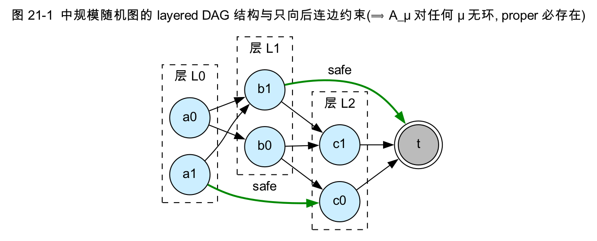

# 第五部分　数据集构造(草稿,可直接整理进 docx)

> 复现实验的关键不只是算法,还在于**用满足论文假设的图族去检验算法**。本部分讲三件事:统一的输入/输出格式与可手算的 toy 图;中规模随机图生成器(`generate_medium_graphs.py`)如何**用 layered DAG 结构保证假设 2.1/5.1 成立**;以及陷阱图族(`generate_trap_graphs.py`)如何**故意构造让 baseline 落入 improper** 以验证 Prop 4.1/4.2。

---

## 第 20 章　数据格式与 Toy 图

### 20.1 TXT 输入格式

图以纯文本给出(`docs/INPUT_OUTPUT.md`):

```text
n terminal
对每个节点 x = 0 .. n-1:
    该节点的 action 数
    每个 action 一行:  action_id  后继数  (to cost) (to cost) ...
```

约定:节点编号 `0..n-1`;`terminal` 是吸收终点,其 action 数为 `0`;所有代价 `finite、≥ 0 且 < 5e99`(防与哨兵 `INF=1e100` 冲突);同一节点内 `action_id` 互不相同。第一个列出的后继是该 action 的 **nominal 后继**(baseline 用),其余是对手的备选。

### 20.2 Toy 图(`data/toy_graph.txt`)

```text
6 5            # 6 节点,终点 5
2             # 节点 0:2 个 action
0 2 1 1.0 2 1.0   # a0: 后继 {1(代价1.0), 2(代价1.0)}  ← 对手可选 1 或 2
1 1 3 3.0         # a1: 后继 {3(代价3.0)}
1             # 节点 1:a0 → {5(1.0)}
0 1 5 1.0
1             # 节点 2:a0 → {4(1.0)}
0 1 4 1.0
1             # 节点 3:a0 → {5(4.0)}
0 1 5 4.0
1             # 节点 4:a0 → {5(100.0)}
0 1 5 100.0
0             # 节点 5:终点
```

该图是论文 `J_μ = 最长路` 思想的**最小可手算实例**:节点 0 的 `a0` 有两个对抗后继 `{1,2}`,名义上很便宜(代价 1),但对手可把你送向高代价分支 `2→4→5`(累计 102);`a1` 代价 3 但稳定(`3→5`,累计 7)。手算与 VI 迭代验证 `J* = [7,1,101,4,100,0]`、最优动作 `a1`(完整推导见第二部分 §4.5)。配图见 `report/figures/toy_graph.svg`、`toy_values.svg`、`toy_steps.svg`。

### 20.3 JSON 格式(可视化用)

`data/toy_graph.json` 给出同一图的结构化表示(`n / terminal / nodes[].actions[].successors[]`),供 `visualization/plot_graph.py` 绘制图结构;它由 `io::write_graph_json` 生成,与 `.txt` 一致(`tests/test_lct.cpp::test_toy_json_matches_txt` 校验)。

---

## 第 21 章　中规模随机图生成器(`experiments/generate_medium_graphs.py`)

实验 3(效率比较)与实验 4(鲁棒性)需要一批**满足假设、规模可控、可复现**的随机图。生成器用 **layered DAG(分层有向无环图)**,这一结构选择直接对应论文假设。

### 21.1 分层与"只向后连边"

```python
def build_layers(n):
    nonterminal_count = n - 1
    layer_count = max(2, min(10, nonterminal_count // 4))
    layers = [[] for _ in range(layer_count)]
    for node in range(nonterminal_count):
        layer = min(layer_count - 1, node * layer_count // nonterminal_count)
        layers[layer].append(node)
    return [layer for layer in layers if layer]

def later_nodes(layers, layer_index, terminal):
    candidates = []
    for layer in layers[layer_index + 1:]:   # 只取更后的层
        candidates.extend(layer)
    candidates.append(terminal)              # 终点始终可选
    return candidates
```

**关键设计**:每个非终点节点的后继只能取**更靠后的层或终点**。这保证弧子图 `A_μ` 对**任何**策略 `μ` 都**无环**(节点编号沿层严格递增)。



> **▶ 与论文假设的对应(本章亮点)**:`A_μ` 恒无环 ⟹ 任何策略都 proper ⟹ **假设 2.1(b)(improper 正环)平凡满足**(根本没有 improper 策略);再加 §21.3 的非负代价 ⟹ **假设 4.3/5.1** 也满足。于是这批图上 VI/PI/Dijkstra-like 的收敛性(定理 A/B/C)全部有保障。

### 21.2 强制 "safe" 动作保证 proper 存在

```python
for action in range(actions_per_node):
    forced = safe_next if action == 0 else None     # action 0 强制指向一个确定的后续节点
    successors = choose_successors(rng, candidates, successors_per_action, forced)
```

`choose_successors` 把 `forced`(= `candidates[0]`,最近的后续层节点或终点)放入 action 0 的后继并去重。这保证**每个非终点节点至少有一条 "safe" 动作通向更后层**,沿这些 safe 动作必在有限步到达终点。

> **▶ 与假设 2.1(a) 的对应**:safe 动作链构成一个**显式的 proper 策略** ⟹ 假设 2.1(a)(proper 存在)被构造性满足。我们曾形式化验证:`build_layers` 总产出非空、严格递增的层;forced 后继总落在更后层或终点;`choose_successors` 永不返回空集(否则会触发 `validate()` 报错)。并经 672/672 边界配置实测(`n∈{3..20}×actions∈{1,2,3}×successors∈{1,2,5,50}`)全部 VI `success=1`。

### 21.3 代价、随机种子与可复现性

```python
cheap = round(rng.uniform(min_cost, max_cost), 6)   # 默认 [1, 20],非负
rng_seed = args.seed * 1_000_003 + n * 9_176 + s * 53 + case   # 含 s:跨 s 独立采样
graph_seed = args.seed + case                                   # 写入文件名的 display_seed
```

代价取 `[1, 20]` 的均匀分布(非负,满足假设 5.1(c));`rng_seed` **包含 `s`**,使同一 `(n, case)` 下不同 successor 上界 `s` 的图来自**独立随机流**(这是我们代码评审修复的一项:原公式漏了 `s`,会让跨 `s` 样本相关)。每张图文件名规范:

```
medium_n{n}_s{s}_a{actions}_case{case}_seed{graph_seed}.txt
```

### 21.4 元数据 schema

生成器额外输出 `graph_metadata.csv`(13 列),便于复现与审计:

```csv
graph_id,n,actions,case,base_seed,display_seed,rng_seed,requested_s,min_actual_s,max_actual_s,avg_actual_s,min_cost,max_cost
```

其中 `requested_s` 是请求的 successor 上界,`min/max/avg_actual_s` 是实际达到的不同后继数(靠近终点的层因候选不足,实际 `s` 可能小于请求值)。

### 21.5 实验用规模

- **实验 3**:`n ∈ {20,50,100,200}`,每规模 20 张,`actions=3`,`successors=2`,`seed=42`。
- **实验 4**:`n=50`,`successors-values 1 2 3 4 5`(单次生成所有 `s`),每 `s` 20 张,`seed=42`。

---

## 第 22 章　陷阱图族(`experiments/generate_trap_graphs.py`)

### 22.1 动机:layered DAG 掩盖了 baseline 失效

第 21 章的 layered DAG 保证**每个**策略都 proper,因此实验 4 中所有策略的 `valid_rate ≡ 1.0`——baseline 与 robust 的差异只体现在 worst-case **代价**上,baseline 从不"失败"。但论文 Prop 4.1 表明:当 baseline 选出含**正环**的 improper 策略时,其 `J_μ = ∞`。为定量展示这一失败模式,需要一类**存在 proper 策略、但 baseline 会被诱导选入 improper** 的图。

### 22.2 陷阱 gadget 设计(3 节点)

```python
# 节点 0 = u, 1 = v, 终点 2 = t
out.write("3 2\n")
out.write("2\n")                                       # u:两个 action
out.write(f"0 2 2 {cheap_t} 1 {cheap_v}\n")            # a0 risky: 后继 {t(便宜), v}
out.write(f"1 1 2 {safe_cost}\n")                      # a1 safe : 后继 {t(贵)}
out.write("1\n")                                       # v:一个 action
out.write(f"0 2 2 {gamma} 0 {delta}\n")                # b0: 后继 {t(便宜), u}  ← 对手可送回 u
out.write("0\n")                                       # t:终点
```

随机代价:`cheap_t, cheap_v, gamma, delta ~ U(1,5)`,`safe_cost ~ U(1,30)`。

### 22.3 机理:便宜的名义捷径在对抗下成环

- **nominal/bestcase baseline** 只看便宜的 *nominal* 后继(`a0` 的首后继 `t` 便宜),于是在 `u` 选 `a0`、在 `v` 选 `b0`;
- 但在**真实鲁棒语义**下,`a0` 的后继含 `v`、`b0` 的后继含 `u` ⟹ 策略图含正环 `u → v → u`;
- 由 **Prop 4.1(d)**,该 improper 策略 `J_μ = ∞`,`check_policy_proper` 判其 improper,`policy_valid = 0`、`worst_cost = inf`;
- 而 **VI** 在 `u` 选 safe 动作 `a1`(直达 `t`),策略 proper、代价有限。

> **▶ 与论文的对应**:这是 **Prop 4.1/4.2 的构造性实例**——一张同时拥有 proper 策略(`{u=a1,v=b0}`)与"诱人但含正环"improper 策略(`{u=a0,v=b0}`)的图。`nominal_takes_trap = (cheap_t < safe_cost)` 记录 baseline 是否被诱入陷阱(`safe_cost` 抽得较大时即被诱入,多数情形如此)。

### 22.4 实验 4b 结果(预告)

20 张陷阱图、`--start 0` rollout:`baseline_nominal`/`baseline_bestcase` 的 `valid_rate = 0.15`(20 张里 17 张失效)、`baseline_worst_immediate = 0.50`、`vi = 1.00`。这定量印证了 Prop 4.1:baseline 在对抗结构图上会产出 `J_μ = ∞` 的 improper 策略,而 robust VI 始终有效(详见第六部分 §27)。

---

## 第五部分小结

数据集构造贯穿一条主线:**让数据服从论文假设、并让数据检验论文结论**。
- layered DAG(`generate_medium_graphs.py`)用"只向后连边 + 强制 safe 动作 + 非负代价"**构造性地保证假设 2.1/5.1**,为实验 1/3/4 提供合法、可复现、规模可控的图族;
- 陷阱图(`generate_trap_graphs.py`)反其道而行,**故意构造 baseline 会落入的 improper 陷阱**,把 Prop 4.1(improper 正环 ⟹ `J_μ=∞`)从纸面定理变成可观测的 `valid_rate=0.15`。

两者一正一反,共同支撑第六部分对算法正确性与鲁棒性优势的实证。
