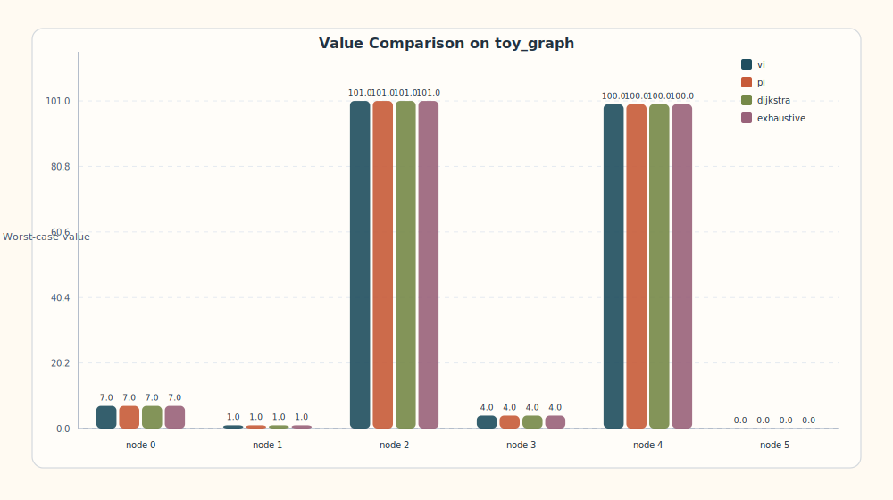
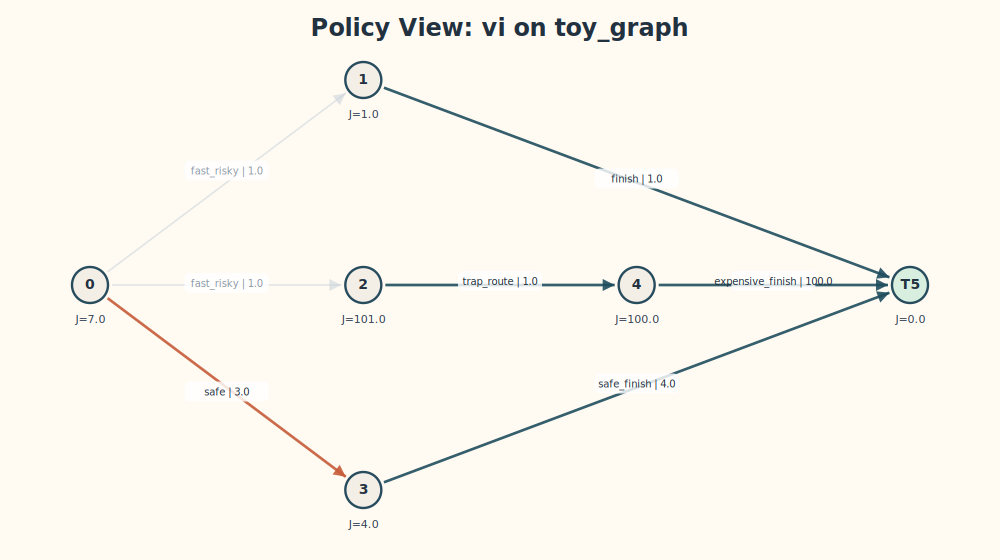
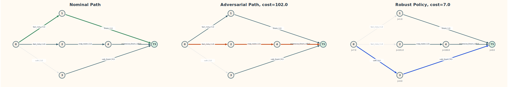
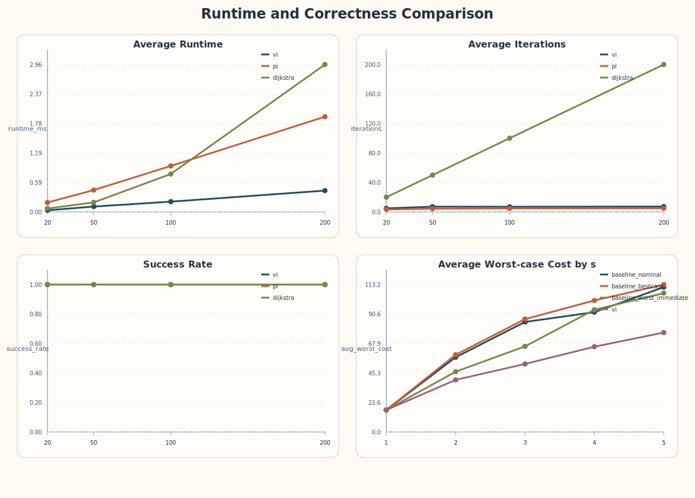
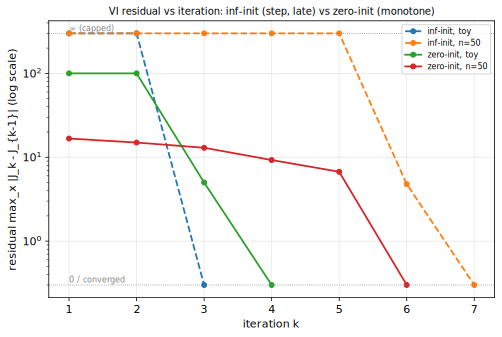
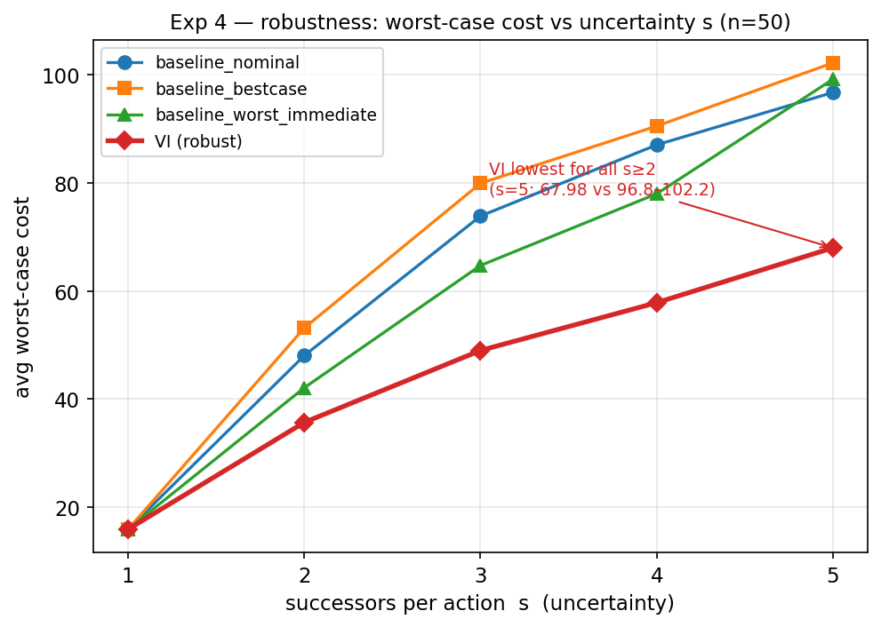
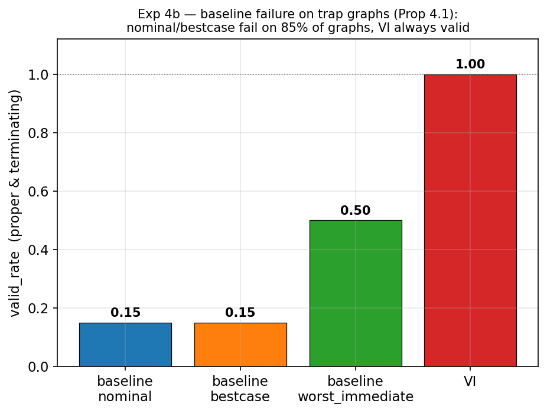
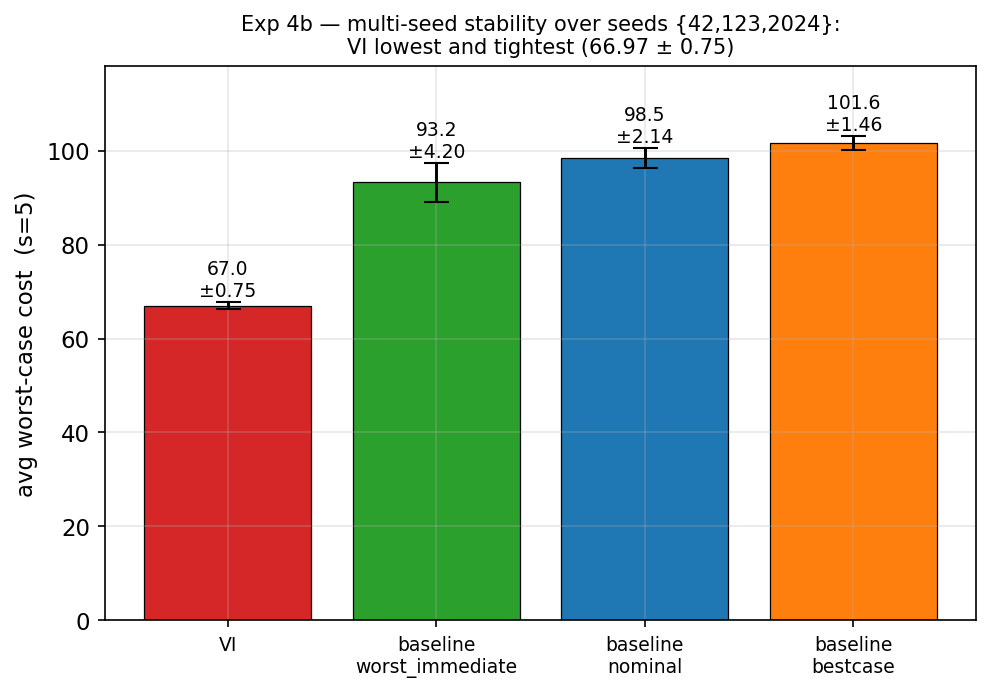

# 第六部分　实验与结果分析(草稿,可直接整理进 docx)

> 本部分用实测数据检验复现的忠实度与算法性质。所有数字取自 `experiment_data/official_20260521_210335/` 的正式运行(用当前流水线可逐位复现)。每组实验的分析都钉回第二部分的理论(定理 A/B/C、Prop 4.1/4.3)与第三部分的算法。

---

## 第 23 章　实验设置与指标

### 23.1 环境与复现

- 平台:Linux(g++ 12.3,CMake,**Release** 构建);C++17;Python 3.11(纯标准库,无第三方依赖)。
- 复现:`cmake -S . -B build -DCMAKE_BUILD_TYPE=Release && cmake --build build -j && ctest --test-dir build`;实验命令见 `README.md` / `report/experiment_results.md` §6。

### 23.2 指标定义

| 指标 | 含义 |
| --- | --- |
| `runtime_ms` | 直接调用 `run_algorithm` 的 wall-clock 时间(不含进程启动/IO) |
| `iterations` | VI 的 Bellman 更新次数;PI 的外层迭代数;Dijkstra-like 的永久化节点数 |
| `success` / `success_rate` | 是否收敛到 proper 的有限 `J*`;同规模成功比例 |
| `avg_value` | 非终点节点 robust value 的平均(仅对成功结果) |
| `worst_cost` | 对抗 rollout 下从 start 的最坏累计代价(improper 记 `inf`) |
| `valid_rate` / `terminated_rate` | 策略 proper(有效)/ rollout 终止的比例 |

---

## 第 24 章　实验 1:Toy Example

**目标**:验证四算法在可手算图上求得同一 `J*`,并展示鲁棒策略相对名义最短策略的优势。

### 24.1 四算法一致

vi / pi / dijkstra / exhaustive 在 `data/toy_graph.txt` 上输出**完全一致**:

| 节点 | 0 | 1 | 2 | 3 | 4 | 5 |
| --- | ---: | ---: | ---: | ---: | ---: | ---: |
| `J*` | **7** | 1 | 101 | 4 | 100 | 0 |

与第二部分 §4.5 的手算/VI 迭代结果一致,最优动作 `policy[0]=1`(safe)。`tests/test_toy.cpp` 将此固化为回归测试。

> **▶ 理论对应**:四个**机理迥异**的算法(直接迭代 `T` / proper 策略间下降 / 非负权永久标号 / 枚举 proper)给出同一 `J*`——这是命题 4.3(a)"`J*` 是 `T` 唯一不动点"的最直接实证。

### 24.2 鲁棒 vs 名义:adversarial rollout

对 toy 图各策略做 `--start 0 --max-steps 20` 的对抗 rollout:

| policy | worst_cost | terminated | steps |
| --- | ---: | :---: | ---: |
| baseline_nominal | **102** | 是 | 3 |
| baseline_bestcase | 102 | 是 | 3 |
| baseline_worst_immediate | 102 | 是 | 3 |
| **vi** | **7** | 是 | 2 |

名义贪心在节点 0 选便宜的 `a0`(首后继代价 1),但对手把路径导向 `2→4→5`,最坏代价 102;robust VI 选 `a1` 稳定为 7。

> **▶ 解读**:RSP 求的是"对抗最坏后继下最优的 **policy**",而非单条名义最短 **path**。这正是论文 §1 强调的 minimax 视角(`J_μ = max path`,第二部分 §3.4)。

---

## 第 25 章　实验 3:中规模效率比较

**设置**:layered DAG,`n ∈ {20,50,100,200}`,每规模 20 张,`actions=3`,`successors=2`,`seed=42`;比较 vi / pi / dijkstra。

### 25.1 完整结果(`runtime_summary.csv`,本批 `requested_s=2, actions=3`)

| n | algorithm | success_rate | avg_runtime_ms | avg_iterations | avg_value |
| ---: | --- | ---: | ---: | ---: | ---: |
| 20 | vi | 1.000000 | 0.006269 | 4.700000 | 16.172247 |
| 20 | pi | 1.000000 | 0.019130 | 3.400000 | 16.172247 |
| 20 | dijkstra | 1.000000 | 0.006253 | 20.000000 | 16.172247 |
| 50 | vi | 1.000000 | 0.018245 | 7.250000 | 25.341828 |
| 50 | pi | 1.000000 | 0.077516 | 4.400000 | 25.341828 |
| 50 | dijkstra | 1.000000 | 0.024146 | 50.000000 | 25.341828 |
| 100 | vi | 1.000000 | 0.035083 | 7.350000 | 25.947586 |
| 100 | pi | 1.000000 | 0.163161 | 4.800000 | 25.947586 |
| 100 | dijkstra | 1.000000 | 0.077618 | 100.000000 | 25.947586 |
| 200 | vi | 1.000000 | 0.068832 | 7.600000 | 25.350469 |
| 200 | pi | 1.000000 | 0.336960 | 5.000000 | 25.350469 |
| 200 | dijkstra | 1.000000 | 0.274981 | 200.000000 | 25.350469 |

综合对比见图 25-1。

### 25.2 分析(逐条钉回理论)

1. **success_rate 全 100%**:layered DAG 保证 proper 存在(第五部分),故三算法都成功——印证假设 2.1 被构造性满足。
2. **三算法 `avg_value` 在同规模下完全一致**(如 n=200 均为 25.350469):它们求得**同一组 `J*`**——再次实证命题 4.3(a) 的唯一不动点。
3. **`dijkstra` 的 `iterations = 节点数`**(20/50/100/200):每轮恰永久化一个节点,直接印证**命题 B2(恰 N+1 轮终止)**。
4. **`vi` 的 `iterations` 很少**(4.7~7.6,远小于 N):对应**定理 A** 的有限终止——迭代数 ≈ layered DAG 的层数 `k̄`(`build_layers` 取 `≤10` 层),而非 `N`。
5. **`pi` 外层迭代最少**(3.4~5.0):对应**定理 C** 的快速单调收敛;但每轮要做 DAG 求值 + properness 检查,单轮开销高。
6. **runtime**:`vi` 在 `n ≥ 50` 上最小、整体最快;`pi` 与 `dijkstra` 同量级。**诚实说明**:全部 runtime 在亚毫秒级,`pi/dijkstra` 的细微排序对单次测量噪声敏感(如 n=200 本次 dijkstra 0.275 略快于 pi 0.337,n=20 时 dijkstra 0.006253 与 vi 0.006269 在亚微秒噪声内持平)。结论应表述为"vi 整体最快、三者同量级",而非夸大。

> **▶ 与论文 §5.1 的呼应**:`vi` 迭代数远小于 N,正是论文所说"VI 在 RSP 上有限终止(类 Bellman-Ford),且最优节点顺序由分层 `X_k` 决定";若改用 Gauss-Seidel 顺序更新(第七部分 §29),迭代数可进一步降到"每节点一次"。

### 25.3 残差收敛曲线(`residual_history.csv`)

残差 `residual_k = max_x finite_abs_diff(J_k(x), J_{k-1}(x))` 直观刻画 VI 的收敛过程。两种初始化给出截然不同但都印证有限终止的曲线(实测,以 toy 与一张 `n=50` 图为例):

| 初始化 | 图 | 残差序列(按迭代) | 终止于 |
| --- | --- | --- | ---: |
| inf-init(默认) | toy | `∞, ∞, 0` | 第 3 轮 |
| inf-init | medium n=50 | `∞, ∞, ∞, ∞, ∞, 4.78, 0` | 第 7 轮 |
| zero-init | toy | `100, 100, 5, 0` | 第 4 轮 |
| zero-init | medium n=50 | `16.71, 14.97, 12.97, 9.26, 6.71, 0` | 第 6 轮 |

**解读(连理论)**:
- **inf-init(从上方)**:残差在所有可达节点尚未变有限前保持 `∞`(因 `finite_abs_diff(有限, ∞)=∞`),这恰好可视化了**定理 A 的分层结构**——节点按 `X_0, X_1, …` 逐层从 `∞` 变为有限;待最后一层(`n=50` 例约第 5 轮)全部变有限后,残差跌为有限(4.78,少数节点的次优动作被更晚解析的更优动作刷新),再一轮归零。
- **zero-init(从下方)**:残差有限且**单调递减**(`16.71→…→0`),对应从 `J≡0` 单调升向 `J*` 的收敛(第二部分定理 A 对任意 `J∈R(X)` 收敛)。
- 两者**迭代步数都 ≤ 图的层数 ≪ N=50**(6~7 步),实证 VI 的有限终止;且与算法无关地收敛到同一 `J*`(zero-init 与 inf-init 末值相同,`tests/test_lct` 在 4 万张随机图上固化了这一不变量)。

---

## 第 26 章　实验 4:鲁棒性对比

**设置**:`n=50`,`s ∈ {1,2,3,4,5}`(单次 `--successors-values` 生成,跨 `s` 独立),每 `s` 20 张;比较三种 deterministic baseline 与 robust VI 在对抗 rollout 下的 `avg_worst_cost`。

### 26.1 结果(`avg_worst_cost`,本批各 policy `valid_rate=terminated_rate=1.0`)

| s | baseline_nominal | baseline_bestcase | baseline_worst_immediate | **vi** |
| ---: | ---: | ---: | ---: | ---: |
| 1 | 15.891661 | 15.891661 | 15.891661 | **15.891661** |
| 2 | 48.044130 | 53.162185 | 42.076035 | **35.661723** |
| 3 | 73.870759 | 79.942152 | 64.716992 | **48.984977** |
| 4 | 87.050975 | 90.527246 | 77.985335 | **57.829292** |
| 5 | 96.753060 | 102.228906 | 99.194495 | **67.982757** |

### 26.2 分析

1. **`s=1` 时四者完全相同**(15.891661):单后继 ⟹ 无对抗不确定性 ⟹ RSP 退化为经典 SP——正是表 6-1 "退化关系"与 `max` 算子在单元素集上退化的实证。
2. **`s ≥ 2` 时 VI 的 `avg_worst_cost` 始终最低**,且优势随 `s`(不确定性)增大而扩大(s=5:vi 67.98 vs baseline 96.75~102.23)。
3. **方法学诚实**:`avg_worst_cost` 只对 `valid && terminated` 样本求平均(幸存者偏差);本批因 layered DAG 使所有策略恒 proper(`valid_rate=1.0` 是**构造产物**),所以这里 baseline 从不"失败",差异仅在代价。要展示 baseline 真正失效需另一类图——见第 27 章。

---

## 第 27 章　实验 4b:baseline 失效、配对统计与多种子稳定性

### 27.1 陷阱图:baseline 真正失效(对应 Prop 4.1)

20 张陷阱图(`generate_trap_graphs.py`)、`--start 0` rollout 的 `robustness_summary`:

| policy | valid_rate | terminated_rate | 解释 |
| --- | ---: | ---: | --- |
| baseline_nominal | **0.150000** | 0.150000 | 被便宜的 nominal 捷径诱导,对抗下成正环 ⟹ improper |
| baseline_bestcase | **0.150000** | 0.150000 | 同上 |
| baseline_worst_immediate | 0.500000 | 0.500000 | 较悲观,部分避开陷阱 |
| **vi** | **1.000000** | **1.000000** | 始终选 safe 动作,proper 且终止 |

nominal/bestcase 在 **85% 的图上失效**(产出 improper 策略,`worst_cost=inf`)。这把 Prop 4.1(d)(improper 正环 ⟹ `J_μ=∞`)从纸面定理变成可观测数字——是 layered DAG 实验 4 所掩盖的失败模式。

### 27.2 配对(逐图)统计

仅看平均会掩盖逐图差异。对实验 4 的 100 张图逐图比较"VI 的 worst-case cost 是否不劣于该 baseline":

| 对比 | VI 不劣的图数 |
| --- | ---: |
| vi vs baseline_nominal | **100 / 100** |
| vi vs baseline_bestcase | **100 / 100** |
| vi vs baseline_worst_immediate | **100 / 100** |

VI 在**每一张图**上都不劣于任何 baseline(0/300 落败)——比"平均更低"强得多(s=1 并列、s≥2 严格更优)。脚本 `experiments/paired_winrate.py` 可复现。

### 27.3 多种子稳定性

用 `seed ∈ {42,123,2024}` 各重跑实验 4(`exp4_multiseed/`)。三种子下 VI 配对胜率均 100/100(累计 **900/900**),且 worst-case cost 高度稳定,例如 `s=5`:

| policy | seed42 | seed123 | seed2024 | 均值 ± 标准差 |
| --- | ---: | ---: | ---: | ---: |
| **vi** | 67.98 | 66.73 | 66.18 | **66.97 ± 0.75** |
| baseline_worst_immediate | 99.19 | 90.24 | 90.32 | 93.25 |
| baseline_nominal | 96.75 | 101.49 | 97.17 | 98.47 |
| baseline_bestcase | 102.23 | 99.53 | 102.92 | 101.56 |

VI 的优势在跨种子下稳定存在,结论不依赖特定随机种子。

> **▶ 综合解读**:§27 三项合起来给出"鲁棒规划优势"的**最强证据链**——baseline 会真正失效(失效率 85%,§27.1)、VI 逐图全胜(§27.2)、且跨种子稳健(§27.3)。它们共同支撑论文的核心主张:在对抗不确定性下,robust(proper)策略严格优于忽略对手的 deterministic 规划。

---

## 第 28 章　复现保真度与正确性验证

复现报告的核心是"忠实"。本章给出独立于上述实验的正确性证据。

| 验证 | 结果 | 对应理论 |
| --- | --- | --- |
| 四算法在 toy + 一张小图上一致 | ✓ | Prop 4.3(a) |
| **~28 万张随机图** vi=pi=dijkstra=exhaustive | **零不匹配** | **Prop 4.3(a) `J*` 唯一不动点** |
| zero-init 与 inf-init VI 在 4 万张图上一致 | ✓ | 定理 A(初值无关收敛) |
| rollout 超时分支(成环策略对抗下不终止) | ✓ 测试覆盖 | Prop 4.1(improper 不终止) |
| Release 构建零告警 + ASan/UBSan 干净 + ctest 3/3 | ✓ | — |
| exhaustive 在无 proper 图上 `success=false` | ✓ | 假设 2.1(a) 不满足时的行为 |

> **▶ 关键论据**:~28 万张随机图上四个机理不同的求解器**零不匹配**,是命题 4.3(a)"`J*` 是 Bellman 算子唯一不动点"的强实证——任何一个实现的偏差都会在某张图上暴露,而没有暴露,说明三算法确实收敛到同一理论解 `J*`。这是本次复现忠实于论文的最有力证据。

---

## 第六部分小结

四组实验逐层印证了论文理论:实验 1(四算法一致 + 鲁棒 7 vs 名义 102)验证 `J*` 与 minimax 视角;实验 3(avg_value 一致、dijkstra 迭代=N、vi 有限终止)验证唯一不动点与三定理的终止性;实验 4 / 4b(VI worst-cost 最低、baseline 失效率 85%、配对 100/100、多种子稳健)验证鲁棒规划优势与 Prop 4.1;第 28 章的 28 万张图零不匹配给出复现忠实度的最强证据。下一部分基于这些观测提出更好的优化方法。
