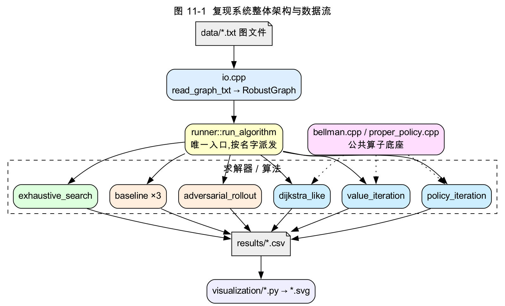
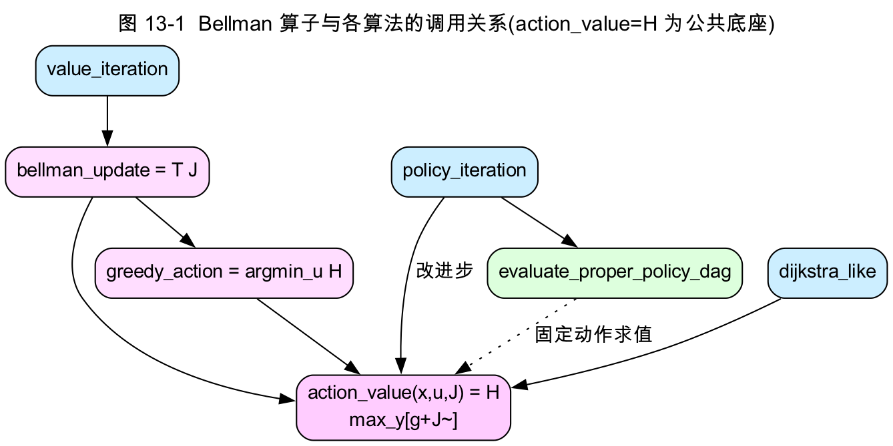

# 第四部分　复现实现 / 源码精讲(草稿,可直接整理进 docx)

> 本部分把第三部分的伪代码与第二部分的公式逐一落到项目 `red` 分支的 C++ 实现上。每章给:**接口签名 → 关键代码片段 → 逐块讲解 → 论文公式对应**。代码片段为实际源码(略去断言/边界检查,完整见仓库)。

---

## 第 11 章　系统架构与工程体系

### 11.1 仓库结构

```
include/rsp/   公共 C++ 接口(所有成员以此为准):graph/bellman/runner/io/proper_policy/...
src/           算法、baseline、runner、IO 实现
experiments/   随机图生成(generate_medium_graphs.py / generate_trap_graphs.py)+ 批量实验入口(run_runtime.cpp / run_robustness.cpp)
tests/         单元测试(test_toy / test_hhm / test_lct)
visualization/ 纯 SVG 可视化(无第三方依赖)
data/          toy 图;report/ 报告与图;docs/ 接口与格式文档;.github/ CI
```

### 11.2 统一接口与数据流

所有算法通过**统一三件套**对接:`graph.hpp`(数据)、`bellman.hpp`(算子)、`runner.hpp`(运行)。数据流:

```
读图(io::read_graph_txt) → run_algorithm(图, 算法名) → 结果结构 → CSV(io::append_*) → 可视化(visualization/*.py)
```

`runner::run_algorithm` 是唯一入口,把 `"vi"/"pi"/"dijkstra"/"exhaustive"/"baseline_*"` 派发到各实现并归一化为 `AlgorithmRunResult`。



### 11.3 构建与 CI

`CMakeLists.txt`:C++17,默认 Release,`-Wall -Wextra -Wpedantic`(GNU/Clang 守卫,含 MSVC 支持),选项 `RSP_ENABLE_SANITIZERS`、`RSP_WERROR`。`.github/workflows/ci.yml`:`ubuntu+macos` × `Debug+Release` 矩阵、Sanitizer job、strict-warnings(`-Werror`)job、generator/runtime/robustness/viz 冒烟(含数值断言)。

---

## 第 12 章　核心数据结构与数值工具

### 12.1 图的数据结构(`include/rsp/graph.hpp`)

```cpp
struct Transition { int to = -1; double cost = 0.0; };          // 一条 (y, g)
struct Action { int action_id = -1; std::string name;
                std::vector<Transition> trans; };               // 一个 u 及其后继集 Y(x,u)
struct Node { int id = -1; std::vector<Action> actions; };      // 一个节点 x 及其 U(x)
class RobustGraph {
public:
    int n = 0;            // 节点数(含终点)
    int terminal = -1;    // 终点 t
    std::vector<Node> nodes;
    bool is_terminal(int x) const { return x == terminal; }
    void validate() const;                                       // 契约检查
};
```

**与论文对应**:`Node.actions` = `U(x)`;`Action.trans` = `Y(x,u)` 连同代价 `g(x,u,y)`;`terminal` = `t`。约定 `policy[x]` 存 **action 下标**(非 `action_id`),`policy[terminal] = -1`。

### 12.2 数值工具(`include/rsp/utils.hpp`)

```cpp
constexpr double INF = 1e100;      // "+∞" 哨兵(表示 improper/不可达节点的 J=∞)
constexpr double EPS = 1e-9;
inline bool is_inf(double x) { return x >= INF / 2.0; }
inline double safe_add(double a, double b) {                    // ∞ + 有限 = ∞,防溢出
    if (is_inf(a) || is_inf(b)) return INF;
    if (a > INF / 2.0 - b) return INF;
    return a + b;
}
inline double finite_abs_diff(double a, double b) {             // 残差:两端 ∞ 记 0,单端 ∞ 记 ∞
    if (is_inf(a) && is_inf(b)) return 0.0;
    if (is_inf(a) || is_inf(b)) return INF;
    return std::abs(a - b);
}
inline bool less_with_eps(double a, double b) { return a < b - EPS; }   // 严格小于(带容差)
```

**与论文对应**:`INF` 实现 `J_μ=∞`(命题 4.1(d));`finite_abs_diff` 让**不可达节点**(恒 `∞`)不阻碍 VI 收敛判据(对应定理 A 中"不在任何 `X_m` 的节点保持 ∞");`less_with_eps` 保证 min/改进的浮点稳健与 tie-break 确定性。

---

## 第 13 章　Bellman 算子(`src/bellman.cpp`)

三算子 `H / T_μ / T`(第二部分 (4.3)–(4.5))逐一实现。



### 13.1 `action_value` = `H(x, u, J)`(内层 max)

```cpp
double action_value(const RobustGraph& graph, int x, int action_index,
                    const std::vector<double>& J) {
    if (graph.is_terminal(x)) return 0.0;
    double worst = -INF;
    for (const auto& tr : graph.nodes[x].actions[action_index].trans) {
        const double next = graph.is_terminal(tr.to) ? 0.0 : J[tr.to];   // J̃(y)
        const double candidate = safe_add(tr.cost, next);                // g + J̃(y)
        if (candidate > worst) worst = candidate;                        // max_y
    }
    return worst;
}
```

**对应** (4.3) `H(x,u,J) = max_{y∈Y(x,u)} [g(x,u,y) + J̃(y)]`:`J̃(t)=0` 由 `is_terminal(tr.to)?0:J[tr.to]` 实现;`max_y` 由循环取最大实现;`safe_add` 保证某后继不可达(`J=∞`)时该动作值即 `∞`(对手可逼到 ∞)。

### 13.2 `greedy_action` = `argmin_u`,`bellman_update` = `T J`(外层 min)

```cpp
int greedy_action(const RobustGraph& graph, int x, const std::vector<double>& J) {
    if (graph.is_terminal(x)) return -1;
    double best = INF; int best_idx = -1;
    for (int i = 0; i < (int)graph.nodes[x].actions.size(); ++i) {
        const double candidate = action_value(graph, x, i, J);
        if (less_with_eps(candidate, best)) { best = candidate; best_idx = i; }   // argmin_u
    }
    return best_idx;
}

std::vector<double> bellman_update(const RobustGraph& graph, const std::vector<double>& J) {
    std::vector<double> next(graph.n, INF);
    next[graph.terminal] = 0.0;
    for (int x = 0; x < graph.n; ++x) {
        if (graph.is_terminal(x)) continue;
        double best = INF;                                  // 单遍求 min(优化:避免二次计算)
        const auto& actions = graph.nodes[x].actions;
        for (int a = 0; a < (int)actions.size(); ++a) {
            const double candidate = action_value(graph, x, a, J);
            if (less_with_eps(candidate, best)) best = candidate;
        }
        next[x] = best;                                     // (T J)(x) = min_u H(x,u,J)
    }
    return next;
}
```

**对应** (4.5) `(T J)(x) = min_{u} H(x,u,J)`。`bellman_update` 即算法 7.1 第 3–4 行的一轮全节点更新。`next[terminal]=0` 固定终点值;不可达节点保持 `INF`。`less_with_eps` 的 tie-break 使首个达到最小者被选,结果确定。

---

## 第 14 章　Proper Policy(`src/proper_policy.cpp`)

实现 RSP 的三件核心:找初始 proper 策略、判 proper、DAG 求值。

### 14.1 `find_initial_proper_policy`:反向可达分层(对应式 5.1 的 `X_k`)

```cpp
ProperPolicyResult find_initial_proper_policy(const RobustGraph& graph) {
    std::vector<char> known(graph.n, false);
    known[graph.terminal] = true;                        // X_0 = {t}
    bool changed = true;
    while (changed) {
        changed = false;
        for (int x = 0; x < graph.n; ++x) {
            if (known[x]) continue;
            for (int a = 0; a < (int)graph.nodes[x].actions.size(); ++a) {
                bool all_known = true;
                for (const auto& tr : graph.nodes[x].actions[a].trans)
                    if (!known[tr.to]) { all_known = false; break; }
                if (all_known) {                         // 某 action 全部后继已知 ⟹ x 可达
                    known[x] = true; result.policy[x] = a; changed = true; break;
                }
            }
        }
    }
    result.exists = (known_count == graph.n);
    return result;
}
```

**对应** 式 5.1:`X_{k+1}` 收集"存在某动作 `u` 使 `Y(x,u) ⊂ ∪_{m≤k}X_m`"的节点。**关键是"全部后继已知"**——对抗语义下必须保证所有可能后继都能到终点。`exists=false` 即假设 2.1(a) 不成立(无 proper 策略)。

### 14.2 `check_policy_proper`:Kahn 拓扑判环 + 反向可达(对应 Prop 4.2)

```cpp
if (policy[graph.terminal] != -1) return result;            // policy[t] 必须为 -1
std::vector<std::vector<int>> adj(graph.n), rev(graph.n);
std::vector<int> indeg(graph.n, 0);
for (int x = 0; x < graph.n; ++x) {                         // 建 A_μ 子图:仅 policy 所选动作的弧
    if (graph.is_terminal(x)) continue;
    const int a = policy[x];
    if (a < 0 || a >= static_cast<int>(graph.nodes[x].actions.size())) {
        result.has_cycle = true; return result;
    }
    for (const auto& tr : graph.nodes[x].actions[a].trans) {
        rev[tr.to].push_back(x);
        if (!graph.is_terminal(tr.to)) { adj[x].push_back(tr.to); ++indeg[tr.to]; }  // 非终点子图
    }
}
std::queue<int> q;                                          // Kahn 拓扑排序
for (int x = 0; x < graph.n; ++x)
    if (!graph.is_terminal(x) && indeg[x] == 0) q.push(x);
while (!q.empty()) {
    const int x = q.front(); q.pop();
    result.topo_order.push_back(x);
    for (int y : adj[x]) if (--indeg[y] == 0) q.push(y);
}
result.has_cycle = static_cast<int>(result.topo_order.size()) != graph.n - 1;  // 没覆盖全部非终点 ⟹ 有环
// 再以 t 为源沿 rev 边反向 BFS,求 all_reach_terminal(destination-connected)
result.proper = !result.has_cycle && result.all_reach_terminal;
```

**对应** Prop 4.2 的条件 (2):`!has_cycle` ⟺ `A_μ` 无环;`all_reach_terminal` ⟺ destination-connected。非负代价下二者合取 ⟺ proper ⟺ R(X)-regular。

### 14.3 `evaluate_proper_policy_dag`:逆拓扑最长路(= `J_μ`)

```cpp
std::vector<double> J(graph.n, INF); J[graph.terminal] = 0.0;
for (auto it = check.topo_order.rbegin(); it != check.topo_order.rend(); ++it) {
    const int x = *it;
    J[x] = action_value(graph, x, policy[x], J);     // max_y[g + J(y)],后继已先算
}
return J;
```

**对应** (8.1)/(3.6):按**逆拓扑序**(靠近终点者先算)回代 `J_μ(x) = max_{y}[g + J̃_μ(y)]`,即 DAG 上从 `x` 到 `t` 的最长路。这是 PI 求值与 exhaustive 评估的公共底座。

---

## 第 15 章　值迭代实现(`src/value_iteration.cpp`)

```cpp
ValueIterationResult value_iteration(const RobustGraph& graph, double epsilon,
        int max_iter, bool init_with_inf, bool save_history) {
    result.value.assign(graph.n, init_with_inf ? INF : 0.0);     // J_0 ≡ ∞(或 0)
    result.value[graph.terminal] = 0.0;
    for (int iter = 1; iter <= max_iter; ++iter) {
        std::vector<double> next = bellman_update(graph, result.value);   // J_{k+1}=T J_k
        double residual = 0.0;
        for (int x = 0; x < graph.n; ++x)
            residual = std::max(residual, finite_abs_diff(next[x], result.value[x]));
        result.value = std::move(next);
        result.residual_history.push_back(residual);
        if (!is_inf(residual) && residual < epsilon) { result.converged = true; break; }
    }
    result.policy = extract_greedy_policy(graph, result.value);
    result.final_policy_proper = check_policy_proper(graph, result.policy).proper;
    result.all_values_finite = /* 无非终点节点为 INF */;
    return result;
}
```

**逐块对应**:
- `init_with_inf ? INF : 0.0` ↔ 定理 A 的 `J₀≡∞`(默认);`--zero-init` 用 `J₀≡0`(从下方收敛,用于残差曲线)。
- `bellman_update` ↔ 算法 7.1 第 3–4 行(一轮 `T`)。
- `finite_abs_diff` + `!is_inf(residual)` ↔ 残差判据:不可达节点恒 `∞` 不计入(对应定理 A "不在任何 `X_m`")。
- `all_values_finite` ↔ 是否所有非终点节点都达到有限 `J*`(即图是否 globally proper)。
- `success`(在 runner 中)= `converged && final_policy_proper && all_values_finite`,严格对应"收敛到 proper 的有限 `J*`"。

---

## 第 16 章　策略迭代实现(`src/policy_iteration.cpp`)

```cpp
ProperPolicyResult init = find_initial_proper_policy(graph);
if (!init.exists) {                                  // 无初始 proper 策略:优雅失败(对应定理 C 前提不满足)
    result.value.assign(graph.n, INF);
    result.value[graph.terminal] = 0.0;
    result.policy = init.policy;
    result.converged = false; result.final_policy_proper = false;
    return result;
}
result.policy = init.policy;
for (int iter = 1; iter <= max_outer_iter; ++iter) {
    std::vector<double> J = evaluate_proper_policy_dag(graph, result.policy);   // 求值 J_μ(§14.3)
    std::vector<int> next_policy = result.policy;
    int changes = 0;
    for (int x = 0; x < graph.n; ++x) {
        if (graph.is_terminal(x)) {
            continue;
        }
        const int old_action = result.policy[x];
        double best = action_value(graph, x, old_action, J);
        int best_action = old_action;
        for (int a = 0; a < static_cast<int>(graph.nodes[x].actions.size()); ++a) {
            const double candidate = action_value(graph, x, a, J);
            if (less_with_eps(candidate, best)) {                              // 严格改进
                best = candidate;
                best_action = a;
            }
        }
        if (best_action != old_action) {
            next_policy[x] = best_action;
            ++changes;
        }
    }
    result.policy_change_history.push_back(changes);
    if (changes == 0) {                              // 收敛:μ 满足 Bellman 方程
        result.value = J; result.converged = true; break;
    }
    PolicyCheckResult check = check_policy_proper(graph, next_policy);
    if (!check.proper) {                             // 理论上不会发生(定理 C 第 2 步);优雅失败
        result.value = J; result.converged = false; result.final_policy_proper = false;
        return result;
    }
    result.policy = std::move(next_policy);
}
```

**逐块对应**:`find_initial_proper_policy` ↔ 算法 8.1 第 1 行;`evaluate_proper_policy_dag` ↔ 第 3 行(求值);`less_with_eps` 的严格改进 ↔ 定理 C 第 4 步"严格下降";`changes==0` 即 `μ` 满足 Bellman 方程(收敛);`check_policy_proper` 失败的分支对应定理 C 第 2 步"理论保证 proper、违反即异常"——项目改为**优雅返回 `success=false`**,与 vi/dijkstra 一致(这是我们代码评审的改进项之一)。

---

## 第 17 章　Dijkstra-like 实现(`src/dijkstra_like.cpp`)

```cpp
result.value.assign(graph.n, INF);
result.value[graph.terminal] = 0.0;
std::vector<char> finalized(graph.n, false);
finalized[graph.terminal] = true;                                       // W = {t}
result.finalize_order.push_back(graph.terminal);
result.finalized_count = 1;
while (result.finalized_count < graph.n) {
    int best_node = -1;
    int best_action = -1;
    double best_value = INF;
    for (int x = 0; x < graph.n; ++x) {
        if (finalized[x]) {
            continue;
        }
        for (int a = 0; a < static_cast<int>(graph.nodes[x].actions.size()); ++a) {
            bool all_successors_finalized = true;
            for (const auto& tr : graph.nodes[x].actions[a].trans) {     // Y(x,u) ⊂ W ?
                if (!finalized[tr.to]) {
                    all_successors_finalized = false;
                    break;
                }
            }
            if (!all_successors_finalized) {
                continue;
            }
            const double candidate = action_value(graph, x, a, result.value);   // max_y[g+J(y)]
            if (better_candidate(candidate, x, a, best_value, best_node, best_action)) {
                best_value = candidate;
                best_node = x;
                best_action = a;
            }
        }
    }
    if (best_node < 0) {                       // 无可永久化 ⟹ V̄ 含环(命题 B2),非负代价下应不发生
        result.success = false;
        return result;
    }
    finalized[best_node] = true;               // 永久化当前最小候选
    result.value[best_node] = best_value;
    result.policy[best_node] = best_action;
    result.finalize_order.push_back(best_node);
    ++result.finalized_count;
}
result.success = true;
```

**逐块对应**:`finalized` 集 = 永久集 `W`;`all_succ_finalized` ↔ 算法 9.1 第 5 行 `Y(x,u) ⊂ W`;取全局最小 `best_value` 永久化 ↔ 引理 B1 的非降序永久化;`best_node < 0`(无可永久化)↔ 命题 B2 反证中"剩余集含环"的不可达情形,返回 `success=false`。`better_candidate` 的 `(value, node id, action index)` 三级 tie-break 保证结果确定可复现。

> 注:这是论文 §5.3 的**扫描式**等价实现(每轮 `O(N·A·S)` 全扫),复杂度 `O(N²·A·S)`;堆优化见第七部分 §29。

---

## 第 18 章　Baseline、Exhaustive 与 Rollout

### 18.1 三种确定化 baseline(`src/baseline.cpp`)

```cpp
// 确定化:Nominal=每个 action 取首后继;BestCase=所有后继都作为可选边;WorstImmediate=取即时代价最大的后继
// 在确定化图上从 t 反向 Dijkstra 求最短路 → 得 policy;再用鲁棒语义复核
PolicyCheckResult check = check_policy_proper(graph, result.policy);
if (check.proper) { result.value = evaluate_proper_policy_dag(graph, result.policy); result.success = true; }
```

**意义**:baseline 故意"忽略对手"(只按确定化的名义/乐观/即时-最坏后继做最短路),再把所得 policy 放回**真实鲁棒语义**评估——若该 policy 在对抗下 improper,则 `success=false`(对应 Prop 4.1:含正环 ⟹ `J_μ=∞`)。这是实验 4/4b "baseline vs robust" 的对照基础。

### 18.2 对抗 rollout(`src/baseline.cpp::adversarial_rollout`)

```cpp
for (int step = 0; step < max_steps; ++step) {
    if (graph.is_terminal(x)) { result.terminated = true; result.steps = step; return result; }
    int a = policy[x];
    double worst = -INF; Transition chosen;
    for (const auto& tr : graph.nodes[x].actions[a].trans) {                 // 对手取最坏后继
        double score = safe_add(tr.cost, is_terminal(tr.to)?0:J[tr.to]);     // g + J̃(y)
        if (score > worst + EPS || tie&&smaller_to) { worst = score; chosen = tr; }
    }
    result.cost += chosen.cost; x = chosen.to;
}
```

**对应** (10.1) 的 rollout 思想:沿固定 `policy` 让对手每步取 `argmax_y[g+J̃(y)]`,累加实际代价。对 proper 策略,`worst_cost` 理论上等于 `J[start]`(可作自检不变量)。

### 18.3 Exhaustive ground truth(`src/exhaustive_search.cpp`)

```cpp
// 规模守卫:策略数(各非终点节点动作数之积)>5e6 或 n>2000 ⟹ success=false(避免指数卡死/栈溢出)
constexpr long long kMaxPolicies = 5'000'000;
constexpr int kMaxNodes = 2000;                              // 递归深度 == n
if (graph.n > kMaxNodes) {
    return result;                                           // success 保持 false
}
long long policy_count = 1;
for (int x = 0; x < graph.n; ++x) {
    if (graph.is_terminal(x)) continue;
    const long long actions = static_cast<long long>(graph.nodes[x].actions.size());
    if (actions <= 0 || policy_count > kMaxPolicies / actions) return result;   // 防溢出
    policy_count *= actions;
}
std::vector<int> current(graph.n, -1);
std::function<void(int)> dfs = [&](int x) {
    if (x == graph.n) {                                      // 一个完整策略组合
        ++result.checked_policies;
        if (!check_policy_proper(graph, current).proper) return;
        ++result.proper_policies;
        std::vector<double> value = evaluate_proper_policy_dag(graph, current);
        for (int i = 0; i < graph.n; ++i)
            if (less_with_eps(value[i], result.optimal_value_by_state[i]))      // 逐点取最小 = J*
                result.optimal_value_by_state[i] = value[i];
        result.success = true;
        return;
    }
    if (graph.is_terminal(x)) { current[x] = -1; dfs(x + 1); return; }
    for (int a = 0; a < static_cast<int>(graph.nodes[x].actions.size()); ++a) {  // 枚举动作
        current[x] = a;
        dfs(x + 1);
    }
};
dfs(0);
```

**对应** (2.5) `J*(x)=min_{μ proper} J_μ(x)`:枚举所有策略、对 proper 者按 §14.3 求值、逐点取最小 = `J*`(第二部分定理 6 补充二证明)。仅用于小图作 ground truth;规模守卫是我们代码评审加入的健壮性改进。

---

## 第 19 章　IO、Runner 与 CLI

### 19.1 读图与校验(`src/io.cpp::read_graph_txt`)

按 `.txt` 文法解析(`n terminal` + 每节点 action 块),并做契约校验:`cost ≥ 0` 且 `< INF/2`(防与哨兵冲突)、节点内 `action_id` 唯一、读毕拒绝尾部多余 token、`n` 上限防 OOM。最后调 `graph.validate()`。这些校验把假设 2.1/5.1 的前提(非负代价等)落到入口。

### 19.2 统一派发(`src/runner.cpp::run_algorithm`)

```cpp
if (name == "vi")        { auto r = value_iteration(...);  out.success = r.converged && r.final_policy_proper && r.all_values_finite; }
else if (name == "pi")   { auto r = policy_iteration(...); out.success = r.converged && r.final_policy_proper; }
else if (name == "dijkstra") { auto r = dijkstra_like(graph);   out.success = r.success; }
else if (name == "exhaustive"){ ... out.kind = Baseline; }
else /* baseline_* */    { auto r = deterministic_dijkstra_baseline(graph, mode); out.success = r.success; }
```

把各算法归一化为 `AlgorithmRunResult{name, value, policy, residual_history, iterations, converged, success}`,供 CLI 与批量实验统一调用。`success` 的定义因算法而异,但都对应"收敛到 proper 的有限 `J*`"。

### 19.3 命令行与输出(`src/main.cpp` / `io::append_*`)

`main.cpp` 严格解析 `--input/--algorithm/--output/--max-iter/--epsilon/--zero-init`,退出码 `0`(成功)/`2`(`success=false`)/`1`(异常)。`io::append_*_csv` 输出 `values/policies/residual_history/runtime` 等 CSV(`format_value` 用 `inf` 表示哨兵、RFC4180 转义 graph_id/algorithm),供 `visualization/` 绘图。

---

## 第四部分小结

至此,论文的每个公式与第三部分每段伪代码都有了对应的 C++ 落点(见第二部分末"论文↔代码速查表")。核心链条:`action_value=H` → `bellman_update=T` → `value_iteration`/`policy_iteration`/`dijkstra_like` 三算法 → `proper_policy` 提供求值与判 proper 底座 → `runner/io/main` 串成可运行、可复现的流水线。下一部分讲数据集如何构造,使这些算法在满足假设 2.1/5.1 的图族上被检验。
